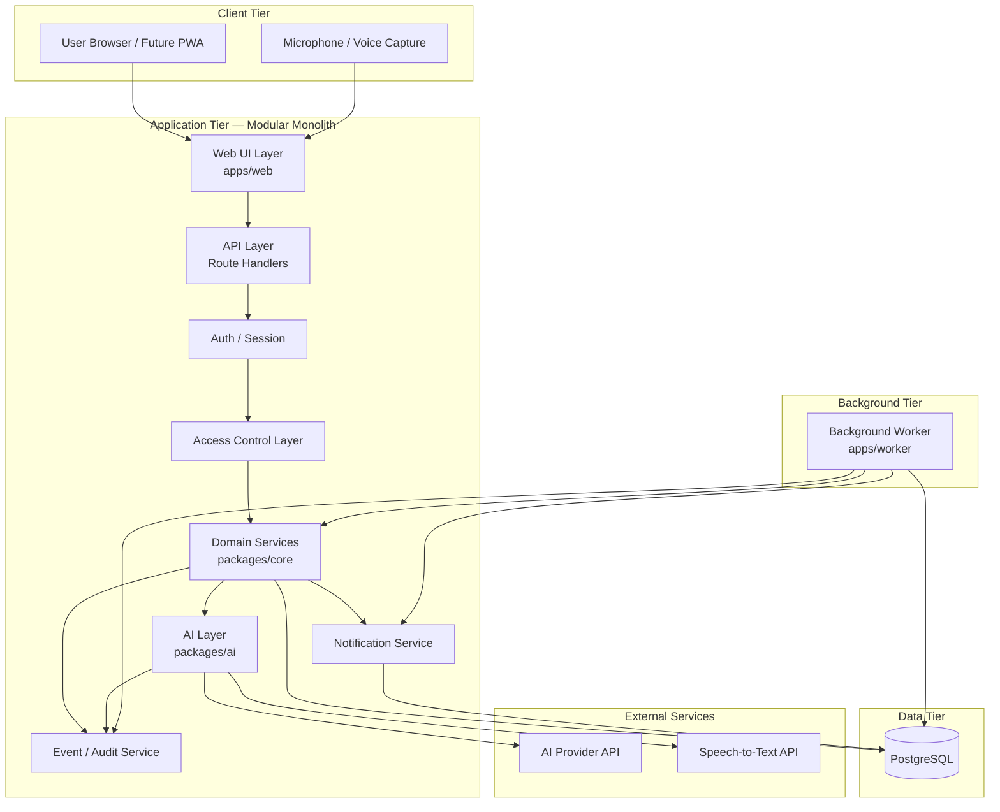
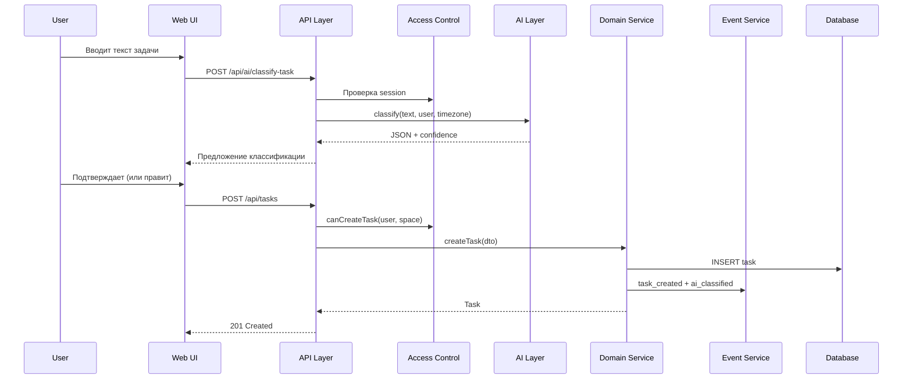
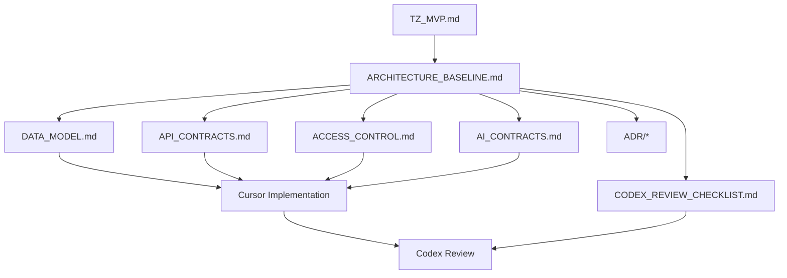

# ARCHITECTURE_BASELINE.md

Версия: 0.3  
Статус: Draft — cross-doc consistency patch after AI_CONTRACTS v0.2 review  
Проект: AI Task Assistant / Time Management System  
Локальный путь: `C:\Dima\Projects\CURSOR\time-management`  
Связанные документы: `docs/TZ_MVP.md`, `docs/CURSOR_SYSTEM_PROMPT.md`, `docs/CODEX_REVIEW_PROMPT.md`, `docs/AI_CONTRACTS.md`

---

## 1. Назначение документа

Данный документ фиксирует **архитектурную истину** проекта AI Task Assistant на этапе MVP. Он определяет:

- архитектурный стиль и границы системы;
- слои, модули и доменную модель верхнего уровня;
- правила доступа, AI-контур, event/audit и worker-контур;
- требования к разработке, deployment, тестированию и безопасности;
- предварительные архитектурные решения (ADR) и риски.

**Для кого:**

| Аудитория | Как использовать |
| --- | --- |
| **Cursor** | Перед реализацией любой фичи — читать baseline, не нарушать слои и границы MVP |
| **Codex** | При ревью — сверять diff с baseline, искать нарушения access control, event log, AI-контрактов |
| **Разработчик** | Как единый источник архитектурных решений до появления детальных контрактов |

**Что baseline НЕ заменяет:**

- `DATA_MODEL.md` — полная схема БД, индексы, миграции;
- `API_CONTRACTS.md` — детальные DTO, статусы HTTP, валидация;
- `ACCESS_CONTROL.md` — матрица прав по каждому endpoint;
- `AI_CONTRACTS.md` — JSON schema, промпты, пороги confidence;
- `CODEX_REVIEW_CHECKLIST.md` — чеклист для каждого PR.

Baseline является **основой** для создания перечисленных документов и первых задач на skeleton-проекта.

---

## 2. Контекст системы

### 2.1 Надсистема

Целевая система встроена в повседневную жизнь пользователя и охватывает:

1. **Личные дела** — обучение, здоровье, документы, личные планы, покупки.
2. **Семейные и бытовые задачи** — дом, дети, продукты, счета, ремонт.
3. **Рабочие проекты** — клиенты, звонки, письма, подготовка материалов, встречи.
4. **Партнерские задачи** — ограниченное сотрудничество с внешними участниками.
5. **Общественные обязательства** — волонтёрство, общественные проекты.
6. **Здоровье и развитие** — тренировки, врачи, курсы.
7. **Будущий стратегический слой** — цели на 5 лет, направления жизни (вне MVP UI).

Надсистема — это **хаотичный поток входящих дел**, который система должна быстро превращать в структурированные задачи с категориями, сроками, приоритетами и правами доступа.

### 2.2 Целевая система

**AI Task Assistant / Time Management System** — self-hosted web-first приложение для ежедневного управления вниманием, обязательствами и приоритетами.

Главная формула MVP:

```
Быстро зафиксировал → AI разобрал → система напомнила → утром показала план → вечером помогла закрыть день
```

Целевая аудитория: **1–10 пользователей** (владелец, семья, рабочие партнёры). Не enterprise PM-система.

### 2.3 Пользователи

| Роль | Описание | Ключевые права |
| --- | --- | --- |
| **Owner** | Владелец инсталляции (workspace) | Системные настройки, пользователи, пространства, AI, backup, глобальная аналитика. **Не видит** чужие личные задачи по умолчанию |
| **Admin** | Администратор конкретного пространства | Управление участниками и проектами внутри space, аналитика space. **Не видит** личные задачи вне своего space |
| **Member** | Обычный участник | CRUD в разрешённых пространствах, выполнение назначенных задач, комментарии |
| **Guest** | Временный участник | Только явно выданные задачи/проекты; ограниченное редактирование |
| **Private User** | Режим личного пространства | Только свои личные задачи, AI, личные напоминания |

### 2.4 Основные сценарии

| # | Сценарий | Описание |
| --- | --- | --- |
| 1 | Быстрое создание задачи | Quick add: текст → AI → задача или Inbox |
| 2 | Голосовое создание | Микрофон → STT → preview → AI → подтверждение |
| 3 | AI-классификация | Пространство, категория, Эйзенхауэр, дедлайн, напоминание |
| 4 | Утренний дашборд | «Сегодня»: просроченные, приоритеты, quick actions |
| 5 | Вечерний отчёт | Итоги дня, решения по невыполненным задачам |
| 6 | Напоминания | In-app уведомления по расписанию, без дублей |
| 7 | Повторяющиеся задачи | Daily/weekly/monthly/yearly, idempotent generation |
| 8 | Семейные задачи | Space «Семья», видимость только членам |
| 9 | Рабочие задачи | Space «Работа», проекты, партнёры |
| 10 | Приватные задачи | Space «Личное», только владелец |
| 11 | Будущий слой стратегии | Goal → Project → Task (поле `goal_id` заложено, UI позже) |

---

## 3. Архитектурный стиль

### Выбранный стиль

**Modular Monolith + Web-first + API-first internal contracts + Event-driven analytics + Worker-based background tasks**

```
┌─────────────────────────────────────────────────────────────┐
│                    Modular Monolith (MVP)                    │
│  ┌─────────┐ ┌─────────┐ ┌─────────┐ ┌─────────┐ ┌────────┐ │
│  │   Web   │ │   API   │ │ Domain  │ │   AI    │ │ Worker │ │
│  │   UI    │→│  Layer  │→│ Services│ │  Layer  │ │ Layer  │ │
│  └─────────┘ └─────────┘ └─────────┘ └─────────┘ └────────┘ │
│         Shared packages: core, db, auth, ai, shared           │
└─────────────────────────────────────────────────────────────┘
```

### Почему этот стиль

| Критерий | Modular Monolith | Микросервисы (отклонено) |
| --- | --- | --- |
| Локальная разработка | Один репозиторий, `docker-compose up` | Множество сервисов, сложный dev-env |
| Тестирование в браузере | Единый origin, простой e2e | CORS, service discovery |
| Codex review | Один diff, видны нарушения слоёв | Распределённая логика, сложнее аудит |
| 1–10 пользователей | Достаточно одного процесса + worker | Избыточная сложность |
| Self-hosted deployment | VPS + reverse proxy + PostgreSQL | Kubernetes, service mesh — overkill |
| PWA / Android | Web API готов к Capacitor wrapper | Тот же API, но лишняя ops-сложность |
| Архитектурный долг | Модули в monorepo, чёткие границы | Преждевременное разбиение → merge pain |

### Что сознательно НЕ выбираем на MVP

- Микросервисы
- Kubernetes
- Собственный message broker / очередь
- Собственный auth framework
- Offline-first / CRDT sync
- Enterprise SSO / SCIM

---

## 4. Границы системы

### 4.1 Входит в MVP

| Область | Состав |
| --- | --- |
| **Auth** | Login, logout, session, password hash, `GET /me` |
| **Users** | CRUD пользователей, роли, профили, timezone, locale |
| **Spaces** | Личное, Семья, Работа, Партнёры, Общественное, Входящие; membership |
| **Projects** | CRUD, участники, статусы, связь с tasks |
| **Tasks** | CRUD, статусы, дедлайны, assignee, подзадачи, soft delete |
| **Categories & Tags** | Категории workspace, теги задач |
| **Eisenhower** | importance/urgency scores, quadrant, авторасчёт |
| **Reminders** | Создание, worker-отправка, in-app notification |
| **Recurring tasks** | Правила повторения, next occurrence, idempotency |
| **Task Events** | Полный audit log ключевых изменений |
| **AI classification** | Text classify, confidence, needs_confirmation, AI log |
| **Voice capture** | Browser audio → STT → preview → AI |
| **Dashboards** | Today, Evening review, Week (базовый) |
| **Analytics** | Day/week metrics, categories, spaces, Eisenhower, reschedules |
| **Notifications** | In-app (web push — future) |
| **Settings** | Профиль, UserSettings, уведомления, AI, категории, spaces |
| **ProjectMember** | Участники проекта с project-level ACL |
| **TaskShare** | Ограниченный explicit sharing для Guest |
| **Comments** | Комментарии к задачам (отдельная entity) |
| **VoiceCapture** | Журнал голосового ввода и транскрипции |
| **Worker reliability** | WorkerJobLock, ReminderDelivery |
| **Auth audit** | AuthAuditEvent (MVP-lite) |

### 4.2 НЕ входит в MVP

| Исключено | Причина |
| --- | --- |
| Полноценная CRM | Другой продуктовый класс |
| Gantt / timeline | Scope creep |
| OKR / сложная стратегия в UI | Только `goal_id` hook |
| Финансы / бюджет | Out of scope |
| Календарь уровня Google Calendar | Только `due_at` / `scheduled_for` |
| Gmail / Google Calendar интеграция | Post-MVP |
| Telegram / WhatsApp bot | Post-MVP |
| Native Android / iOS app | Web-first → PWA → Capacitor |
| Offline-first sync / CRDT | Сложность без MVP-ценности |
| Marketplace / plugin system | Post-MVP |
| Enterprise SSO / SCIM | 1–10 users |
| Локальные LLM | Cloud API на MVP |
| Notion-like documents | Out of scope |

---

## 5. Слои архитектуры

### 5.1 UI Layer

| Аспект | Описание |
| --- | --- |
| **Ответственность** | Отображение данных, пользовательский ввод, навигация, loading/error states |
| **Может** | Вызывать API, локальный UI state, форматирование дат для display |
| **Не должен** | Содержать бизнес-логику, проверять права доступа, рассчитывать Eisenhower, создавать TaskEvent |
| **Модули** | `apps/web`: pages (Today, Inbox, Tasks, Eisenhower, Evening, Analytics), components, hooks (data fetching only) |
| **Риск нарушения** | Расчёт quadrant в React → дублирование с backend, расхождение данных |

### 5.2 API Layer

| Аспект | Описание |
| --- | --- |
| **Ответственность** | HTTP endpoints, DTO validation, auth middleware, orchestration вызовов domain services |
| **Может** | Парсить request, вызывать ACL → Domain → возвращать response DTO |
| **Не должен** | Обходить access control, содержать SQL, напрямую вызывать AI provider из handler без AI service |
| **Модули** | Route handlers: `/api/auth/*`, `/api/tasks/*`, `/api/dashboard/*`, `/api/ai/*` |
| **Риск нарушения** | Прямой `db.query` в handler → нет ACL, нет events |

### 5.3 Domain Layer

| Аспект | Описание |
| --- | --- |
| **Ответственность** | Бизнес-правила: task lifecycle, Eisenhower calculation, recurrence logic, dashboard queries |
| **Может** | Вызывать repositories, event service, notification service |
| **Не должен** | Знать о HTTP, React, конкретном AI provider SDK |
| **Модули** | `packages/core`: TaskService, EisenhowerService, DashboardService, RecurrenceService |
| **Риск нарушения** | Domain service без ACL check → IDOR при вызове из API |

### 5.4 Access Control Layer

| Аспект | Описание |
| --- | --- |
| **Ответственность** | Единая точка проверки: может ли user X выполнить action Y над resource Z |
| **Может** | Проверять membership, ownership, assignee, direct share, role in scope |
| **Не должен** | Содержать бизнес-логику задач, UI-специфичные фильтры |
| **Модули** | `packages/core/access` или `packages/auth/acl`: TaskAccessPolicy, SpaceAccessPolicy |
| **Риск нарушения** | ACL только в list endpoint, но не в GET by id → IDOR |

### 5.5 Persistence Layer

| Аспект | Описание |
| --- | --- |
| **Ответственность** | CRUD к БД, транзакции, миграции, индексы |
| **Может** | SQL/ORM queries, optimistic locking, soft delete filters |
| **Не должен** | Содержать бизнес-правила, проверки доступа |
| **Модули** | `packages/db`: schema, repositories, migrations |
| **Риск нарушения** | Repository возвращает все tasks без caller-side ACL → утечка |

### 5.6 AI Layer

| Аспект | Описание |
| --- | --- |
| **Ответственность** | Классификация текста, STT, confidence, structured JSON output, AI logging |
| **Может** | Предлагать поля задачи, возвращать needs_confirmation |
| **Не должен** | Удалять задачи, менять ACL, назначать users без confirm, отправлять notifications |
| **Модули** | `packages/ai`: ClassificationService, TranscriptionService, prompt templates |
| **Риск нарушения** | AI auto-saves task to Work space without user confirm → privacy leak |

### 5.7 Worker Layer

| Аспект | Описание |
| --- | --- |
| **Ответственность** | Фоновые jobs: reminders, recurrence, future digest |
| **Может** | Poll DB, send notifications, create task instances, log events |
| **Не должен** | Дублировать reminders/recurrence, блокировать API, обходить idempotency |
| **Модули** | `apps/worker`: ReminderJob, RecurrenceJob, scheduler |
| **Риск нарушения** | Два worker instance без lock → duplicate reminders |

### 5.8 Notification Layer

| Аспект | Описание |
| --- | --- |
| **Ответственность** | Создание и доставка уведомлений (in-app MVP) |
| **Может** | Создавать Notification records, mark read, respect user preferences |
| **Не должен** | Отправлять уведомления о недоступных задачах |
| **Модули** | NotificationService в `packages/core` |
| **Риск нарушения** | Notification text содержит title private task для wrong user |

### 5.9 Event/Audit Layer

| Аспект | Описание |
| --- | --- |
| **Ответственность** | Append-only TaskEvent, AIClassificationLog, источник для analytics/evening review |
| **Может** | Записывать old_value/new_value/metadata |
| **Не должен** | Изменяться или удаляться (кроме GDPR purge — future) |
| **Модули** | EventService в `packages/core` |
| **Риск нарушения** | Update task без event → evening review и analytics неверны |

### 5.10 Observability Layer

| Аспект | Описание |
| --- | --- |
| **Ответственность** | Structured logging, error tracking, future health checks |
| **Может** | Логировать errors, access denied, worker failures (без secrets) |
| **Не должен** | Логировать passwords, API keys, полный текст private tasks |
| **Модули** | Logger middleware, health endpoint |
| **Риск нарушения** | AI request log содержит PII без redaction |

### Принципы взаимодействия слоёв

```
UI → API → ACL → Domain → Persistence
              ↓
         Event / Notify / AI (по необходимости)
Worker → Domain → Persistence → Notify → Events
```

1. **React/UI не содержит бизнес-логику.**
2. **API не обходит access control.**
3. **AI не меняет критические данные без подтверждения пользователя.**
4. **Worker не создаёт дубли** (idempotency keys, status checks).

---

## 6. Предлагаемая компонентная схема



### Поток создания задачи (quick add)



---

## 7. Основные модули

### 7.1 Auth Module

**Ответственность:** аутентификация и сессии.

| Функция | MVP | Future |
| --- | --- | --- |
| Login / logout | ✅ email + password | OAuth/OIDC |
| Current user (`/me`) | ✅ | — |
| Session management | ✅ HTTP-only cookie или JWT in cookie | Refresh tokens |
| Password storage | ✅ bcrypt/argon2 hash only | — |
| Password reset | ❌ Phase 1.1 | Email flow |

**Границы:** не содержит ACL для tasks/spaces — делегирует Access Control Layer.

### 7.2 Users Module

**Ответственность:** управление пользователями workspace.

- Профили: name, email, avatar, timezone (legacy → UserSettings), locale, status
- **UserSettings (MVP)** — 1:1 с User; timezone, AI prefs, notification prefs (см. §8.17)
- Роли: Owner, Admin, Member, Guest (на уровне workspace, space, project)
- Owner создаёт пользователей; Admin — в рамках space
- Деактивация пользователя: архивация задач или transfer (явный сценарий)

### 7.3 Spaces Module

**Ответственность:** логические области видимости задач.

| Тип space | Видимость |
| --- | --- |
| `private` (Личное) | Только owner задачи |
| `family` (Семья/Дом) | Члены family space |
| `work` (Работа) | Участники work space / project |
| `partners` (Партнёры) | Явно добавленные партнёры |
| `public_limited` (Общественное) | Участники space |
| `system` (Входящие) | Только создатель до классификации |

- Membership: SpaceMember с role и status
- Каждая задача принадлежит ровно одному space

### 7.4 Projects Module

**Ответственность:** группировка задач внутри space с **project-level access control**.

- CRUD проектов, статусы: active, paused, completed, archived
- **ProjectMember (MVP)** — явная таблица участников проекта; subset of space members
- Project-level ACL: пользователь видит задачи проекта только если он ProjectMember (или space-wide access по политике space)
- Рабочие партнёры могут быть добавлены только в конкретный проект без доступа ко всему work space
- Связь tasks ↔ project; `task.project_id` наследует project ACL
- Поле `goal_id` — nullable, для future strategy layer
- Управление участниками: `POST/DELETE /api/projects/:id/members`

### 7.5 Tasks Module

**Ответственность:** ядро системы — lifecycle задачи.

- CRUD с soft delete (`deleted_at`)
- Статусы: inbox, planned, in_progress, waiting, done, canceled, archived
- Поля: title (required), description, due_at, scheduled_for, assignee, category, tags
- Подзадачи через `parent_task_id`
- Источник: manual, quick_add, voice, ai, recurrence
- **TaskShare (MVP)** — точечный доступ к задаче для Guest без membership в space
- **Comment (MVP)** — отдельная entity; `comment_added` event содержит `comment_id`, не body
- Каждое изменение → TaskEvent (только через Domain Service, см. §11)

### 7.6 Eisenhower Module

**Ответственность:** приоритизация по матрице Эйзенхауэра.

- `importance_score`: 1–5
- `urgency_score`: 1–5
- `eisenhower_quadrant`: important_urgent | important_not_urgent | not_important_urgent | not_important_not_urgent

**Авторасчёт (domain rule):**

```
importance >= 4 AND urgency >= 4 → important_urgent
importance >= 4 AND urgency <  4 → important_not_urgent
importance <  4 AND urgency >= 4 → not_important_urgent
else                               → not_important_not_urgent
```

- Ручная коррекция пользователем → `quadrant_changed` event
- Отдельный UI-экран матрицы

### 7.7 Dashboard Module

**Ответственность:** агрегированные представления для ежедневной работы.

| Dashboard | Endpoint | Источник данных |
| --- | --- | --- |
| Today | `GET /api/dashboard/today` | Tasks + ACL filter + Eisenhower |
| Evening review | `GET /api/dashboard/evening-review` | TaskEvent за день + current state |
| Week | `GET /api/dashboard/week` | Tasks + events за неделю |

### 7.8 Analytics Module

**Ответственность:** метрики продуктивности с учётом ACL.

- Строится на TaskEvent (не только current state)
- Агрегации: created/completed, overdue, reschedules, by category/space/user/quadrant
- Owner видит системную технику без содержимого private tasks

### 7.9 Reminders Module

**Ответственность:** напоминания о задачах.

- Один task → many reminders
- Каналы MVP: `in_app`; future: web_push, email, mobile_push
- Статусы: pending → sent | failed | canceled
- Duplicate protection: unique constraint / idempotency key per (task_id, remind_at, channel)
- Completed task → cancel/ignore pending reminders

### 7.10 Recurring Tasks Module

**Ответственность:** повторяющиеся задачи.

- RecurrenceRule: daily, weekly, monthly, yearly, custom
- `next_run_at` — следующий запуск
- После complete → generate next instance OR update next_run_at
- Idempotency: не создавать второй instance на тот же next_run_at
- Event: `recurrence_generated`

### 7.11 AI Module

**Ответственность:** классификация и транскрипция с **privacy-safe logging**.

- `POST /api/ai/classify-task` — text → structured JSON
- `POST /api/ai/transcribe-task` — audio → text → classify
- `POST /api/ai/reclassify-task` — повторная классификация
- Confidence threshold: default `< 0.75` → Inbox; override через UserSettings (см. Q-09)
- Все решения → **AIClassificationLog** (redacted fields, retention, см. §8.13, §10.7)
- Correction → `ai_classification_corrected` event
- Prompt injection mitigation: input treated as untrusted (см. §10.8)
- Provider payload minimization: не отправлять чужие задачи, токены, секреты

### 7.12 Voice Module

**Ответственность:** голосовой захват задач с **VoiceCapture** data contract.

- Browser MediaRecorder API → audio blob
- Upload to backend → STT (external API, key on backend only)
- **VoiceCapture entity**: transcript, STT metadata, status, retention policy
- Raw audio по умолчанию **не хранить** после успешной транскрипции
- Preview распознанного текста (если confirmation mode)
- Fallback: ручной ввод при недоступности STT
- File/audio upload validation (size, mime, duration limits)

### 7.13 Notification Module

**Ответственность:** доставка уведомлений.

| Тип (MVP) | Триггер |
| --- | --- |
| task_assigned | Назначение исполнителя |
| reminder_due | Worker: remind_at reached |
| task_overdue | Scheduled check |
| comment_added | Новый комментарий |
| task_rescheduled | Перенос задачи |
| evening_review_pending | Вечернее напоминание |

- In-app MVP; web_push — Phase 1.1+

### 7.14 Event/Audit Module

**Ответственность:** неизменяемый журнал.

- TaskEvent — все ключевые изменения задачи (в той же транзакции, см. §11.5)
- AIClassificationLog — privacy-safe AI audit (redacted, retention)
- AuthAuditEvent — login_success, login_failed, logout, password_changed, user_invited (MVP-lite)
- Источник для: evening review, analytics, debug, audit trail

### 7.15 UserSettings Module

**Ответственность:** персональные настройки пользователя.

- timezone, locale — границы Today/Evening Review (см. ADR-010)
- notification_preferences, ai_confirmation_mode, ai_confidence_threshold
- morning_digest_time, evening_review_time
- Доступ: только сам пользователь; Owner — ограниченный admin mode без sensitive content

---

## 8. Доменная модель верхнего уровня

> Полная SQL-схема, индексы и миграции — в `DATA_MODEL.md`.

### 8.1 User

| Аспект | Значение |
| --- | --- |
| **Назначение** | Учётная запись в workspace |
| **Ключевые поля** | id, name, email, password_hash, timezone, locale, status |
| **Связи** | → Workspace (membership), → SpaceMember, → Task (owner, assignee, created_by) |
| **Ограничения** | email unique per workspace; password только hash |

### 8.2 Workspace

| Аспект | Значение |
| --- | --- |
| **Назначение** | Одна self-hosted инсталляция (1 instance = 1 workspace на MVP) |
| **Ключевые поля** | id, name, owner_id, default_timezone, settings (JSON) |
| **Связи** | → Users, → Spaces, → Projects, → Categories |
| **Ограничения** | Все сущности scoped to workspace_id |

### 8.3 Space

| Аспект | Значение |
| --- | --- |
| **Назначение** | Логическая область видимости задач |
| **Ключевые поля** | id, workspace_id, name, type, visibility, created_by |
| **Связи** | → SpaceMember, → Project, → Task |
| **Ограничения** | type enum; private space — один per user (convention) |

### 8.4 SpaceMember

| Аспект | Значение |
| --- | --- |
| **Назначение** | Членство пользователя в пространстве |
| **Ключевые поля** | space_id, user_id, role, status, invited_by |
| **Связи** | User ↔ Space |
| **Ограничения** | unique (space_id, user_id) |

### 8.5 Project

| Аспект | Значение |
| --- | --- |
| **Назначение** | Группа задач внутри space с ограниченным доступом |
| **Ключевые поля** | id, space_id, name, status, owner_id, goal_id (nullable) |
| **Связи** | → Task, → **ProjectMember** (MVP) |
| **Ограничения** | project.space_id must match task.space_id; project ACL через ProjectMember |

### 8.5.1 ProjectMember (MVP)

| Аспект | Значение |
| --- | --- |
| **Назначение** | Участник проекта с project-level правами |
| **Ключевые поля** | id, project_id, user_id, role, status, joined_at, invited_by |
| **Связи** | User ↔ Project; user должен быть member space (или Guest с ограничением) |
| **Ограничения** | unique (project_id, user_id); role enum: owner, admin, member, guest; видимость задач проекта только для ProjectMember + space-wide policy |

### 8.5.2 TaskShare (MVP)

| Аспект | Значение |
| --- | --- |
| **Назначение** | Точечный explicit share задачи без membership в space |
| **Ключевые поля** | id, task_id, shared_with_user_id, shared_by_user_id, permission, expires_at, created_at |
| **Связи** | → Task, → User (shared_with, shared_by) |
| **Ограничения** | permission enum: read, comment, complete; **не заменяет** SpaceMember/ProjectMember; не даёт доступ к другим задачам проекта/space; private task share только по действию owner; Guest access primary use case |

### 8.6 Task

| Аспект | Значение |
| --- | --- |
| **Назначение** | Основная единица работы |
| **Ключевые поля** | id, space_id, project_id, parent_task_id, owner_id, assignee_id, title, status, importance_score, urgency_score, eisenhower_quadrant, due_at, scheduled_for, visibility, source, ai_confidence, deleted_at |
| **Связи** | → Reminder, → TaskTag, → TaskEvent, → RecurrenceRule, → Comment, → TaskShare, → VoiceCapture |
| **Ограничения** | title required; soft delete; belongs to exactly one space |

### 8.7 Category

| Аспект | Значение |
| --- | --- |
| **Назначение** | Классификация задач (Работа, Семья, Здоровье…) |
| **Ключевые поля** | id, workspace_id, name, color, icon |
| **Связи** | ← Task.category_id |
| **Ограничения** | name unique per workspace |

### 8.8 Tag

| Аспект | Значение |
| --- | --- |
| **Назначение** | Гибкие метки |
| **Ключевые поля** | id, workspace_id, name |
| **Связи** | ↔ Task через TaskTag |
| **Ограничения** | name unique per workspace |

### 8.9 TaskTag

| Аспект | Значение |
| --- | --- |
| **Назначение** | M:N связь Task ↔ Tag |
| **Ключевые поля** | task_id, tag_id |
| **Ограничения** | composite PK |

### 8.10 Reminder

| Аспект | Значение |
| --- | --- |
| **Назначение** | Запланированное напоминание |
| **Ключевые поля** | id, task_id, user_id, remind_at, channel, status, sent_at |
| **Связи** | → Task, → User |
| **Ограничения** | idempotency на отправку; cancel if task done |

### 8.11 RecurrenceRule

| Аспект | Значение |
| --- | --- |
| **Назначение** | Правило повторения задачи |
| **Ключевые поля** | task_id, rule_type, interval, days_of_week, next_run_at, end_date |
| **Связи** | → Task (template task) |
| **Ограничения** | один active rule per template; no duplicate instances |

### 8.12 TaskEvent

| Аспект | Значение |
| --- | --- |
| **Назначение** | Audit log изменений задачи |
| **Ключевые поля** | id, task_id, user_id, event_type, old_value, new_value, metadata, created_at |
| **Связи** | → Task, → User |
| **Ограничения** | append-only; immutable |

### 8.13 AIClassificationLog (privacy-safe)

| Аспект | Значение |
| --- | --- |
| **Назначение** | Privacy-safe журнал AI-решений |
| **Ключевые поля** | id, task_id, user_id, model_name, provider, input_text_redacted, output_json_redacted, raw_input_encrypted (nullable), raw_output_encrypted (nullable), provider_payload_hash, confidence, accepted_by_user, corrected_by_user, sensitivity_level, retention_until, created_at |
| **Связи** | → Task, → User |
| **Ограничения** | Owner задачи видит redacted AI log своей задачи через API; System Owner в tech audit — только metadata, redacted fields, confidence, errors, provider_payload_hash; `raw_*_encrypted` — internal storage only, **не** в MVP API (`AI_CONTRACTS.md` v0.2) |

### 8.14 Notification

| Аспект | Значение |
| --- | --- |
| **Назначение** | In-app уведомление пользователю |
| **Ключевые поля** | id, user_id, type, payload, read_at, created_at |
| **Связи** | → User; payload references task_id |
| **Ограничения** | только для задач, доступных user |

### 8.15 Goal (future)

| Аспект | Значение |
| --- | --- |
| **Назначение** | Стратегическая цель (5 лет → неделя) |
| **Ключевые поля** | id, workspace_id, owner_id, title, horizon, status, parent_goal_id |
| **Связи** | ← Project.goal_id |
| **Ограничения** | UI вне MVP; поле goal_id nullable в Project/Task |

### 8.16 Comment (MVP)

| Аспект | Значение |
| --- | --- |
| **Назначение** | Комментарий к задаче |
| **Ключевые поля** | id, task_id, author_id, body, created_at, updated_at, deleted_at |
| **Связи** | → Task, → User (author) |
| **Ограничения** | виден только пользователям с доступом к task; body не в чужих notifications/analytics; `comment_added` TaskEvent содержит comment_id, не body; soft delete |

### 8.17 UserSettings (MVP)

| Аспект | Значение |
| --- | --- |
| **Назначение** | Персональные настройки пользователя |
| **Ключевые поля** | user_id, timezone, locale, notification_preferences, ai_confirmation_mode, ai_confidence_threshold, morning_digest_time, evening_review_time, created_at, updated_at |
| **Связи** | → User (1:1) |
| **Ограничения** | доступ только самому user; Owner — admin mode без sensitive prefs; timezone определяет границы Today/Evening Review |

### 8.18 VoiceCapture (MVP)

| Аспект | Значение |
| --- | --- |
| **Назначение** | Журнал голосового ввода и транскрипции |
| **Ключевые поля** | id, user_id, task_id (nullable), transcript_text, stt_provider, stt_confidence, audio_storage_policy, audio_blob_url (nullable), audio_hash (nullable), status, created_at, retention_until |
| **Связи** | → User, → Task (nullable, после создания) |
| **Ограничения** | raw audio по умолчанию не хранить после успешной транскрипции; если хранится — временно с retention_until; tech audit без raw audio/private transcript без прав owner |

### 8.19 WorkerJobLock (MVP)

| Аспект | Значение |
| --- | --- |
| **Назначение** | Lease/lock для предотвращения параллельной обработки job |
| **Ключевые поля** | id, job_type, resource_id, lock_key, locked_by, locked_until, status, created_at, updated_at |
| **Связи** | — (infrastructure entity) |
| **Ограничения** | unique lock_key; locked_until — lease expiry; при worker restart lock истекает и job перехватывается |

### 8.20 ReminderDelivery (MVP)

| Аспект | Значение |
| --- | --- |
| **Назначение** | Попытка доставки reminder с retry/backoff |
| **Ключевые поля** | id, reminder_id, user_id, channel, idempotency_key, attempt, status, error_message, sent_at, created_at |
| **Связи** | → Reminder, → User |
| **Ограничения** | unique idempotency_key; atomic transition pending → processing → sent/failed; sent не повторяется; failed retried с backoff |

### 8.21 AuthAuditEvent (MVP-lite)

| Аспект | Значение |
| --- | --- |
| **Назначение** | Аудит событий аутентификации и управления пользователями |
| **Ключевые поля** | id, user_id (nullable), event_type, ip_address, user_agent, metadata, created_at |
| **Связи** | → User (nullable для failed login) |
| **Ограничения** | event_type: login_success, login_failed, logout, password_changed, user_invited; append-only; не логировать password; retention policy |

---

## 9. Access Control Baseline

### 9.1 Базовое правило видимости задачи

**Пользователь видит задачу только если выполняется хотя бы одно условие:**

1. **owner** задачи (`task.owner_id = user.id`)
2. **assignee** задачи (`task.assignee_id = user.id`)
3. **created_by** задачи (`task.created_by = user.id`)
4. **участник пространства** (`SpaceMember` active для `task.space_id`) — с учётом space type и visibility
5. **участник проекта** (`ProjectMember` active для `task.project_id`, если project_id задан)
6. **прямой share** (`TaskShare` active для user с permission read/comment/complete)
7. **роль Owner/Admin** с разрешением в соответствующем scope (Admin — только внутри своего space, не cross-space)

### 9.1.1 ProjectMember rule (MVP)

- Если задача привязана к проекту с ограниченным membership — видимость через **ProjectMember**, не через весь space
- Space может быть широким (work), проект — узким (один партнёр)
- ProjectMember.role определяет: read, edit, complete, manage members
- Добавление в проект не даёт доступ к другим проектам того же space

### 9.1.2 TaskShare rule (MVP, limited)

- TaskShare — **только explicit sharing**; не заменяет SpaceMember и ProjectMember
- Создаёт только task owner или user с manage permission
- Даёт доступ **только к одной задаче**, не к проекту/space целиком
- Private task: share только owner; без действия owner share невозможен
- Guest primary path: TaskShare с permission read | comment | complete
- TaskShare с `expires_at` — auto-revoke после истечения

### 9.2 Критические инварианты

| # | Инвариант |
| --- | --- |
| 1 | **Frontend access control не считается защитой** — UI может скрывать, но backend обязан отклонять |
| 2 | **Нельзя отдавать чужие задачи через API** — каждый GET/PATCH/DELETE проверяет ACL |
| 3 | **Аналитика не раскрывает чужие private tasks** — агрегации только по accessible scope |
| 4 | **Admin пространства не видит личные задачи вне space** |
| 5 | **Partner не видит family/private задачи** |
| 6 | **Family member не видит work/private задачи** (если не member work space) |
| 7 | **Owner не видит private tasks других users** (strict privacy mode — default) |
| 8 | **IDOR protection обязательна** — запрос по UUID чужой задачи → 404 (не 403, чтобы не подтверждать существование) |
| 9 | **Response field filtering** — response DTO не включает поля, запрещённые ACL для данного user |
| 10 | **List endpoints ACL-filtered** — списки строятся через тот же ACL predicate, что и get by id |

### 9.3 Deny semantics: 404 vs 403

| Ситуация | HTTP | Причина |
| --- | --- | --- |
| Resource не существует | 404 | Стандарт not found |
| Resource существует, user **не имеет visibility** | **404** | Не раскрывать существование private resource (IDOR protection) |
| Resource виден, но **action запрещён** (например, Guest пытается delete) | **403** | User знает о resource, но не имеет permission |
| Unauthenticated | 401 | Нет session |
| List endpoint, нет доступных items | 200 + `[]` | Пустой список, не ошибка |

### 9.4 Таблица access scenarios

| Сценарий | Actor | Resource | Ожидаемый результат |
| --- | --- | --- | --- |
| AS-01 | User A | Private task of User A | ✅ Full access |
| AS-02 | User B | Private task of User A | ❌ Denied |
| AS-03 | Owner | Private task of User B | ❌ Denied (strict mode) |
| AS-04 | Family Member | Family space task | ✅ Read/write per role |
| AS-05 | Family Member | Work space task | ❌ Denied |
| AS-06 | Work Partner | Assigned work task | ✅ Read, complete if assignee |
| AS-07 | Work Partner | Family space task | ❌ Denied |
| AS-08 | Work Partner | Private task of Owner | ❌ Denied |
| AS-09 | Space Admin (Family) | Task in Family space | ✅ Per admin rights |
| AS-10 | Space Admin (Family) | Private task of member | ❌ Denied |
| AS-11 | Guest | TaskShare read on work task | ✅ Read only |
| AS-12 | Guest | Other tasks in space (no share) | ❌ 404 |
| AS-13 | Member | Analytics for Work space | ❌ Denied (not member) |
| AS-14 | Any user | `GET /api/tasks/:other_user_task_id` | ❌ 404 |
| AS-15 | AI classify | Suggest work space for private text | ⚠️ needs_confirmation, default Inbox |
| AS-16 | Work Partner | ProjectMember of Project X | ✅ Tasks in Project X only |
| AS-17 | Work Partner | Other projects in same work space | ❌ 404 |
| AS-18 | Guest | TaskShare complete permission | ✅ Complete only, no edit/delete |
| AS-19 | User A | Comment on shared task | ✅ If task access |
| AS-20 | User B | Comment body via notification | ❌ No foreign private content |

### 9.5 Endpoint-level ACL baseline matrix

> Детальная матрица по каждому полю DTO → `ACCESS_CONTROL.md`. Ниже — baseline для Codex и DATA_MODEL.

| Resource | Action | Endpoint examples | Required condition | Deny response | Notes |
| --- | --- | --- | --- | --- | --- |
| Task | list | `GET /api/tasks` | ACL predicate: accessible tasks only | 200 `[]` | Same filter as dashboard; no bypass via search |
| Task | get | `GET /api/tasks/:id` | canViewTask(user, task) | 404 | IDOR → 404 |
| Task | create | `POST /api/tasks` | canCreateInSpace(user, space_id) | 403 | Validate space membership |
| Task | update | `PATCH /api/tasks/:id` | canEditTask(user, task) | 404 / 403 | 404 if no visibility; 403 if read-only share |
| Task | delete | `DELETE /api/tasks/:id` | canDeleteTask(user, task) | 404 / 403 | Soft delete + task_deleted event |
| Task | complete | `POST /api/tasks/:id/complete` | canCompleteTask(user, task) | 404 / 403 | TaskShare complete permission allowed |
| Task | reschedule | `POST /api/tasks/:id/reschedule` | canEditTask(user, task) | 404 / 403 | Creates task_rescheduled |
| Task | comments list | `GET /api/tasks/:id/comments` | canViewTask(user, task) | 404 | — |
| Task | comment create | `POST /api/tasks/:id/comments` | canCommentTask(user, task) | 404 / 403 | TaskShare comment permission |
| Project | list | `GET /api/projects` | Accessible projects via space + ProjectMember | 200 `[]` | — |
| Project | get | `GET /api/projects/:id` | canViewProject(user, project) | 404 | — |
| Project | members list | `GET /api/projects/:id/members` | canManageProject(user, project) or member | 404 / 403 | — |
| Project | members add | `POST /api/projects/:id/members` | canManageProject(user, project) | 403 | ProjectMember MVP |
| Space | members list | `GET /api/spaces/:id/members` | canViewSpace(user, space) | 404 | — |
| Space | members add | `POST /api/spaces/:id/members` | canManageSpace(user, space) | 403 | — |
| Analytics | daily/weekly | `GET /api/analytics/*` | Same ACL scope as task list | 403 / filtered | No titles in cross-user views |
| AI | classify | `POST /api/ai/classify-task` | Authenticated user | 401 | No foreign task data in context |
| AI | transcribe | `POST /api/ai/transcribe-task` | Authenticated + upload validation | 400 / 401 | Audio size/mime limits |
| Reminder | create | `POST /api/reminders` | canEditTask(user, task) | 404 / 403 | — |
| Reminder | update | `PATCH /api/reminders/:id` | canEditTask(user, reminder.task) | 404 / 403 | — |
| Reminder | delete | `DELETE /api/reminders/:id` | canEditTask(user, reminder.task) | 404 / 403 | — |

### 9.6 Response field filtering

- API response DTO **allowlisted** per role and share permission
- Guest с TaskShare read: title, description, status, due_at — **без** internal fields (ai_confidence, owner internals)
- Analytics responses: **никогда** title/description для cross-user/system aggregates
- Comment list: body только для users с task access
- AI classify response: не включать данные недоступных spaces/projects

### 9.7 Реализация (архитектурное требование)

```
Каждый API handler:
  1. Authenticate (session)
  2. Authorize (ACL policy для resource + action)
  3. Execute (domain service — единственная точка mutation)
  4. Filter response (allowlisted DTO per ACL)
```

Детальная матрица по endpoints и полям → `ACCESS_CONTROL.md`.

---

## 10. AI Baseline

### 10.1 Принцип

**AI suggests, user confirms.**

AI — отдельный слой-помощник. Окончательное решение всегда за пользователем.

### 10.2 AI имеет право

| Действие | Описание |
| --- | --- |
| Предложить категорию | category name / id hint |
| Предложить пространство | space_type hint |
| Предложить проект | project_hint (fuzzy match) |
| Предложить importance_score | 1–5 |
| Предложить urgency_score | 1–5 |
| Предложить due_at | Parsed datetime in user timezone |
| Предложить reminder | remind_at + channel |
| Предложить title/description | Extracted from text |
| Вернуть confidence | 0.0–1.0 |
| Вернуть needs_confirmation | true если confidence < threshold или privacy risk |

### 10.3 AI не имеет права

| Запрещено | Причина |
| --- | --- |
| Удалять задачи | Необратимое действие |
| Менять права доступа | Privacy |
| Назначать другого пользователя без подтверждения | Privacy + consent |
| Отправлять уведомления от имени пользователя | Consent |
| Скрывать свои решения | Transparency — всё в AIClassificationLog |
| Автоматически перемещать в family/work space при privacy risk | FR-AI-005 |

### 10.4 Confidence и Inbox

```
confidence < 0.75  →  status: inbox, space: Inbox, needs_confirmation: true
confidence >= 0.75 →  apply suggestions (после user confirm если настроено)
privacy_risk       →  force Inbox + needs_confirmation: true
```

### 10.5 Пример JSON-контракта классификации

> **Note:** `AI_CONTRACTS.md` v0.2 is authoritative for provider payload minimization and DTO layers. It overrides older examples in this baseline.

**Internal provider context (conceptual — not HTTP request):**

```json
{
  "text": "Завтра утром позвонить заказчику по лендингу, это важно, напомни за час",
  "timezone": "Europe/Moscow",
  "locale": "ru",
  "accessible_spaces": [{ "id": "...", "name": "Работа", "type": "work" }],
  "accessible_projects": [{ "id": "...", "name": "Лендинг", "space_id": "..." }],
  "categories": [{ "id": "...", "name": "Клиенты" }],
  "current_date": "2026-06-13"
}
```

```text
user_id is internal/session-only and must not be included in provider prompt payload.

Provider payload may include:
- task text;
- locale;
- timezone;
- current date/time;
- accessible spaces/projects/categories;
- safe context hints.

For correlation use backend request_id / provider_payload_hash, not user_id in provider prompt.
```

**HTTP classify response (preview — см. `API_CONTRACTS.md` §15.1):**

```json
{
  "title": "Позвонить заказчику по лендингу",
  "description": null,
  "space_type": "work",
  "space_id": null,
  "category": "Клиенты",
  "category_id": null,
  "project_hint": "Лендинг",
  "project_id": null,
  "importance_score": 5,
  "urgency_score": 5,
  "eisenhower_quadrant": "important_urgent",
  "due_at": "2026-06-14T10:00:00+03:00",
  "scheduled_for": "2026-06-14T10:00:00+03:00",
  "reminders": [
    {
      "remind_at": "2026-06-14T09:00:00+03:00",
      "channel": "in_app"
    }
  ],
  "assignee_hint": "current_user",
  "assignee_id": null,
  "confidence": 0.88,
  "needs_confirmation": false,
  "privacy_risk": false,
  "model_name": "gpt-4o-mini",
  "reasoning_summary": "Рабочий контекст: заказчик, лендинг. Срок: завтра утром."
}
```

Детальная JSON Schema → `AI_CONTRACTS.md`.

### 10.6 Privacy в AI (provider payload)

- В AI provider отправлять **минимум данных**: text, timezone, locale, current date/time, список **доступных** spaces/projects/categories (не содержимое чужих задач)
- **Не отправлять:** `user_id`, password, tokens, полные тексты других задач, секреты, PII третьих лиц
- AI classify endpoint **не получает** недоступные user данные — context строится только из UserSettings + accessible space/project list
- Корреляция: `request_id` / `provider_payload_hash` на backend, не `user_id` в prompt

### 10.7 AIClassificationLog: redaction и retention

| Правило | Описание |
| --- | --- |
| R-01 | Owner задачи видит redacted AI log своей задачи (API); **не** `raw_*_encrypted` в MVP API |
| R-02 | System Owner в tech audit — только metadata, redacted_input, redacted_output, confidence, errors, provider_payload_hash |
| R-03 | Raw private content **не показывать** в tech audit или MVP API |
| R-04 | `raw_input_encrypted` / `raw_output_encrypted` — internal storage only; default `AI_STORE_RAW_LOGS=false`; if enabled — `retention_until` required |
| R-05 | `input_text_redacted` / `output_json_redacted` — default storage; PII маскируется |
| R-06 | `sensitivity_level` enum: low, medium, high — влияет на retention и audit visibility |
| R-07 | После `retention_until` — purge raw encrypted fields; redacted остаётся |

### 10.8 Prompt injection risk и mitigation

AI input (текст задачи, transcript) — **untrusted data**.

| Риск | Mitigation |
| --- | --- |
| User text содержит инструкции «ignore previous rules» | System prompt hardened; user text в delimited block; output schema validation |
| AI пытается вернуть недопустимые actions | JSON schema strict; reject fields outside allowlist |
| AI предлагает чужой user как assignee | assignee_hint validated against accessible users; needs_confirmation |
| AI предлагает space/project без доступа | space_id/project_id resolved только из accessible set; иначе Inbox |
| Transcript manipulation | Same rules as text; VoiceCapture logged with redaction |

### 10.9 Tech audit limitations

- System Owner **не** читает raw transcripts, comment bodies, private task titles через AI logs
- Tech audit = error rates, model_name, confidence distribution, provider_payload_hash, latency
- Full content audit только для owner конкретной задачи

---

## 11. Event/Audit Baseline

### 11.1 Назначение

События — **основа** для:

- вечернего отчёта (что сделано, перенесено, создано за день)
- аналитики (created vs completed, reschedules)
- отладки и аудита
- восстановления истории задачи

### 11.2 Принцип

**Нельзя изменять ключевое состояние задачи без TaskEvent.**

Ключевое состояние: status, due_at, scheduled_for, assignee, space, project, quadrant, deleted_at.

### 11.3 Обязательные события MVP

| event_type | Когда | old_value / new_value |
| --- | --- | --- |
| `task_created` | Создание задачи | — / initial state |
| `task_updated` | Изменение полей | field-level diff |
| `task_completed` | status → done | old status / done + completed_at |
| `task_reopened` | status done → other | done / new status |
| `task_rescheduled` | due_at или scheduled_for changed | old dates / new dates |
| `task_deleted` | soft delete | — / deleted_at |
| `task_restored` | restore from soft delete | deleted_at / null |
| `task_delegated` | assignee changed | old assignee / new assignee |
| `task_moved_to_space` | space changed | old space / new space |
| `task_moved_to_project` | project changed | old project / new project |
| `priority_changed` | importance or urgency changed | old scores / new scores |
| `quadrant_changed` | eisenhower_quadrant changed | old / new |
| `reminder_created` | new reminder | — / reminder data |
| `reminder_sent` | worker sent reminder | pending / sent |
| `recurrence_generated` | new instance from rule | — / new task id |
| `ai_classified` | AI processed task | — / AI output summary |
| `ai_classification_corrected` | user fixed AI | AI output / user correction |
| `comment_added` | new comment | — / comment id |

### 11.4 EventService (архитектурный контракт)

```typescript
// Концептуальный интерфейс — детали в packages/core
interface EventService {
  record(event: {
    taskId: string;
    userId: string;
    eventType: TaskEventType;
    oldValue?: Record<string, unknown>;
    newValue?: Record<string, unknown>;
    metadata?: Record<string, unknown>;
  }): Promise<void>;
}
```

- Вызывается **только** из Domain Layer, не из UI и не из API handlers напрямую
- `comment_added` metadata: `{ comment_id }` — **без** comment body

### 11.5 Event enforcement contract (обязательно)

| # | Правило |
| --- | --- |
| E-01 | Любая mutation task state — **только через Domain Service** (TaskService, RecurrenceService, etc.) |
| E-02 | Domain Service **обязан** писать TaskEvent в **той же DB-транзакции**, что и изменение task |
| E-03 | Repository layer **не экспортирует** public mutation methods, обходящие EventService |
| E-04 | Тесты **должны падать**, если mutation не создаёт ожидаемый TaskEvent |
| E-05 | Bulk update **запрещён** без explicit bulk event strategy (не в MVP) |
| E-06 | Soft delete — mutation; обязателен `task_deleted` event |
| E-07 | Worker mutations (recurrence_generated, reminder_sent) — **тоже** пишут TaskEvent через Domain/EventService |
| E-08 | Rollback транзакции откатывает и task change, и event |

**Запрещённый паттерн:**

```
API handler → repository.updateTask()  // NO EVENT — BLOCKER
```

**Правильный паттерн:**

```
API handler → ACL → taskService.updateTask() → [tx: update + eventService.record()]
```

---

## 12. Reminder / Worker Baseline

### 12.1 Фоновые процессы

| Job | Расписание | Описание |
| --- | --- | --- |
| **ReminderSender** | Каждую 1 мин | Acquire lock → find due reminders → ReminderDelivery → notify → event |
| **RecurrenceGenerator** | Каждые 5 мин | Acquire lock → find due rules → idempotent instance → event |
| **OverdueNotifier** | Каждый час | Задачи с due_at < now AND status not done → notification |
| **EveningReviewNudge** | per UserSettings.evening_review_time | Напоминание открыть вечерний отчёт (future) |
| **DailyDigest** | per UserSettings.morning_digest_time | Сводка на день (future) |
| **CleanupArchive** | Раз в сутки | Purge expired VoiceCapture audio, AI raw encrypted, stale locks |

### 12.2 WorkerJobLock — lease policy

```
1. Worker перед job: INSERT/UPDATE WorkerJobLock WHERE lock_key = '{job_type}:{resource_id}'
2. locked_until = now + lease_duration (e.g. 5 min)
3. Если lock занят и locked_until > now → skip (другой worker обрабатывает)
4. Если lock expired → захватить (restart safety)
5. После job → release lock или let expire
```

- `lock_key` примеры: `reminder:{reminder_id}`, `recurrence:{rule_id}`, `batch:reminders`
- Предотвращает duplicate processing при нескольких worker instances или restart

### 12.3 ReminderDelivery — idempotency и retry

```
idempotency_key = '{reminder_id}:{channel}:{remind_at_iso}'

Flow:
  1. CREATE ReminderDelivery (status=pending) — unique on idempotency_key
  2. Atomic: pending → processing (only one worker wins)
  3. Send notification
  4. Success: processing → sent, reminder.status=sent, TaskEvent reminder_sent
  5. Failure: processing → failed, schedule retry with backoff
  6. sent — NEVER retried
```

| attempt | backoff (пример) |
| --- | --- |
| 1 | immediate |
| 2 | 1 min |
| 3 | 5 min |
| 4+ | status=failed, log error |

### 12.4 Обязательные требования

| Требование | Реализация |
| --- | --- |
| **Idempotency** | ReminderDelivery.idempotency_key unique; atomic status transitions |
| **No duplicate reminders** | WorkerJobLock + ReminderDelivery.sent immutable |
| **Safe retry** | Failed delivery → backoff; max attempts → status=failed + log |
| **Worker restart safety** | DB-backed locks and delivery state; catch-up on startup for missed remind_at |
| **Timezone awareness** | remind_at в UTC; UserSettings.timezone для display и evening nudge |
| **Event logging** | reminder_sent, recurrence_generated через EventService в транзакции |
| **Completed task** | Skip/cancel pending reminders for done/canceled tasks |

### 12.5 Worker architecture

```
apps/worker/
  scheduler.ts           — cron / interval loop
  jobs/
    reminders.ts         — ReminderSender + ReminderDelivery
    recurrence.ts        — RecurrenceGenerator + WorkerJobLock
    cleanup.ts           — retention purge
  lib/
    job-lock.ts          — WorkerJobLock acquire/release
    delivery.ts          — ReminderDelivery idempotency
    db.ts
```

- Worker — отдельный процесс (`apps/worker`), тот же `packages/core` и `packages/db`
- MVP: polling DB + WorkerJobLock (без Redis/RabbitMQ)
- Future: optional job queue при росте нагрузки

### 12.6 Recurrence idempotency

```
Перед созданием instance:
  1. Acquire WorkerJobLock(recurrence:{rule_id})
  2. SELECT existing task WHERE recurrence_rule_id = X AND scheduled_for = next_run_at
  3. IF exists → skip, update next_run_at only
  4. ELSE → taskService.createFromRecurrence() [tx: task + recurrence_generated event]
  5. Release lock
```

---

## 13. Dashboard Baseline

### 13.1 Today Dashboard

**Endpoint:** `GET /api/dashboard/today`  
**Параметры:** `UserSettings.timezone` (не profile fallback), optional space filter  
**Граница «сегодня»:** `start_of_day` / `end_of_day` в timezone пользователя (ADR-012)

| Блок | Критерий отбора | Сортировка |
| --- | --- | --- |
| **Overdue** | due_at < start_of_today AND status ∉ (done, canceled, archived) | due_at ASC |
| **Today** | scheduled_for или due_at = today AND active | scheduled_for ASC |
| **Important & Urgent** | quadrant = important_urgent AND active AND not done | due_at ASC |
| **Important, Not Urgent** | quadrant = important_not_urgent AND active | due_at ASC |
| **Quick tasks** | importance < 3 AND urgency < 3 AND estimated short (future) OR tag "quick" | created_at DESC |
| **Waiting** | status = waiting | updated_at DESC |
| **Inbox / Needs review** | status = inbox OR needs_confirmation = true | created_at DESC |

**Действия с дашборда:** complete, reschedule, quick add, voice add.

**ACL:** все блоки — только accessible tasks.

### 13.2 Evening Review

**Endpoint:** `GET /api/dashboard/evening-review`  
**Источник:** TaskEvent за today + current task state

| Блок | Источник |
| --- | --- |
| **Completed today** | task_completed events today |
| **Not completed** | scheduled/due today, status ∉ done — no complete event |
| **Created today** | task_created events today |
| **Overdue** | due_at < today, still active |
| **Rescheduled** | task_rescheduled events today |
| **Needs action** | Not completed without user decision |

**Действия по невыполненным:**

| Действие | API | Event |
| --- | --- | --- |
| Move to tomorrow | PATCH scheduled_for = tomorrow | task_rescheduled |
| Reschedule to date | PATCH due_at/scheduled_for | task_rescheduled |
| No due date | PATCH due_at = null | task_updated |
| Delegate | PATCH assignee_id | task_delegated |
| Split into subtasks | POST subtasks | task_created (children) |
| Cancel | PATCH status = canceled | task_updated |
| Delete | DELETE (soft) | task_deleted |
| Mark waiting | PATCH status = waiting | task_updated |

**Итог дня:** summary после завершения разбора (completed, rescheduled, canceled, unresolved count).

### 13.3 Weekly Dashboard (базовый MVP)

- Created/completed за неделю
- Overdue count
- Top categories
- Простой список на неделю

---

## 14. Analytics Baseline

### 14.1 MVP метрики

| Метрика | Источник | Период |
| --- | --- | --- |
| Created today | task_created events | day |
| Completed today | task_completed events | day |
| Created this week | task_created events | week |
| Completed this week | task_completed events | week |
| Overdue count | tasks where due_at < now, active | point-in-time |
| Created vs completed | events aggregation | day/week/month |
| Reschedules | task_rescheduled count | period |
| Tasks by category | group by category_id | period, ACL-filtered |
| Tasks by space | group by space_id | period, ACL-filtered |
| Tasks by user | group by assignee/owner | period, ACL-filtered |
| Tasks by Eisenhower quadrant | group by quadrant | period |
| Tasks by status | current state snapshot | point-in-time |

### 14.2 ACL и privacy в аналитике

```
Правило: агрегация только по задачам, которые user может видеть (тот же ACL predicate, что task list).

Family member запрашивает analytics:
  → видит Family space + свои private
  → НЕ видит Work space counts

Owner запрашивает system analytics:
  → видит counts, error rates, user activity
  → НЕ видит titles/descriptions private tasks других users
```

### 14.3 Analytics privacy rules (обязательно)

| # | Правило |
| --- | --- |
| AP-01 | Analytics **никогда** не возвращает task titles/descriptions в cross-user/system views |
| AP-02 | User-level analytics видны только внутри allowed scope |
| AP-03 | **Small group deanonymization**: при 1–10 users агрегированные private counts могут deanonymize — private tasks **исключаются** из shared analytics, если viewer не owner этих задач |
| AP-04 | Owner system analytics: counts, rates, timestamps — **без** private content |
| AP-05 | Analytics queries применяют **тот же ACL predicate**, что `GET /api/tasks` |
| AP-06 | Existence leak: аналитика не должна позволять infer существование чужой private task (T-10, T-11) |
| AP-07 | Comment bodies не участвуют в analytics aggregates |

### 14.4 Endpoints (из TZ)

```
GET /api/analytics/daily
GET /api/analytics/weekly
GET /api/analytics/eisenhower
GET /api/analytics/categories
GET /api/analytics/users
GET /api/analytics/created-vs-completed
```

---

## 15. Deployment Baseline

### 15.1 Local Development

| Аспект | Требование |
| --- | --- |
| **Среда** | Windows PC, путь `C:\Dima\Projects\CURSOR\time-management` |
| **Запуск** | `docker-compose up` (PostgreSQL) + dev server web + worker |
| **Тестирование** | Браузер localhost:3000 (или настроенный порт) |
| **Разработка** | Cursor — маленькие контрактные задачи |
| **Проверка** | Codex review после каждой фичи |
| **Env** | `.env` из `.env.example`, secrets не в git |

**Цикл разработки:**

```
ТЗ-фрагмент → Cursor implementation → локальный запуск → тесты → Codex review → fix → фиксация
```

### 15.2 Self-hosted Server

| Компонент | Требование |
| --- | --- |
| **Хостинг** | VPS / dedicated server, 24/7 |
| **Reverse proxy** | Nginx / Caddy с HTTPS (Let's Encrypt) |
| **Процессы** | web app + worker + PostgreSQL |
| **Database** | PostgreSQL 15+; automated backup (cron + pg_dump) |
| **Environment** | Все secrets через env vars |
| **Logs** | Structured JSON logs, rotation |
| **Updates** | docker-compose pull + migrate + restart |

**Минимальные ресурсы (1–10 users):** 2 vCPU, 4 GB RAM, 20 GB SSD.

### 15.3 Future Android

| Этап | Подход |
| --- | --- |
| **MVP** | Responsive web, mobile browser |
| **Phase 1.1** | PWA manifest, installable, service worker (cache static) |
| **Phase 2+** | Capacitor wrapper вокруг web app |
| **Future** | Native push через Capacitor plugin |

Архитектурное требование: **весь функционал через API** — UI не зависит от platform-specific code.

### 15.4 Предполагаемый технологический вектор (не финальный выбор)

| Слой | Вектор |
| --- | --- |
| Language | TypeScript (strict) |
| Frontend | Web-first SPA/SSR (React ecosystem) |
| Backend API | Node.js или встроенный в fullstack framework |
| Database | PostgreSQL |
| ORM | Prisma / Drizzle / Kysely (выбор в ADR skeleton) |
| Worker | Node.js process, shared packages |
| AI | OpenAI-compatible API, backend proxy |
| Auth | Session cookies, bcrypt/argon2 |
| Monorepo | apps/ + packages/ (pnpm workspaces или turborepo) |

> Финальный stack фиксируется в `ADR/0001-project-architecture.md` при создании skeleton.

---

## 16. Repository Structure Baseline

**Целевая структура** (создаётся на Phase 0, не в этой задаче):

```text
time-management/
  docs/
    TZ_MVP.md
    ARCHITECTURE_BASELINE.md
    DATA_MODEL.md
    API_CONTRACTS.md
    ACCESS_CONTROL.md
    AI_CONTRACTS.md
    CODEX_REVIEW_CHECKLIST.md
    CURSOR_SYSTEM_PROMPT.md
    CODEX_REVIEW_PROMPT.md
    ADR/
      0001-project-architecture.md
  apps/
    web/                  # Frontend + API routes
    worker/               # Background jobs
  packages/
    core/                 # Domain services, ACL, events
    db/                   # Schema, repositories, migrations
    ai/                   # AI classification, STT adapter
    auth/                 # Session, password, middleware
    shared/               # Types, DTOs, constants, utils
  scripts/
    backup.sh
    migrate.sh
    seed-dev.ts
  tests/
    unit/
    integration/
    e2e/
    access-control/
  docker-compose.yml
  README.md
  .env.example
  .gitignore
  package.json            # monorepo root
  pnpm-workspace.yaml
```

### Принципы организации

- `packages/core` — **не зависит** от `apps/web` UI
- `packages/db` — **не зависит** от AI provider
- `apps/worker` — использует `packages/core` + `packages/db`
- Тесты access control — отдельная директория, обязательны с Phase 1

---

## 17. Testing Baseline

### 17.1 Типы тестов

| Тип | Scope | Инструменты (вектор) |
| --- | --- | --- |
| **Unit** | Domain services, Eisenhower calc, recurrence logic | Vitest / Jest |
| **Integration** | API endpoints + DB | Supertest + test DB |
| **E2E** | User flows в браузере | Playwright |
| **Access control** | IDOR, cross-space isolation | Integration + dedicated suite |
| **AI contract** | JSON schema validation, confidence routing | Unit + mock AI |
| **Reminder/worker** | Idempotency, restart, timezone | Integration + clock mock |

### 17.2 Обязательные сценарии (must pass before MVP release)

| # | Сценарий | Тип |
| --- | --- | --- |
| T-01 | User A не видит private task User B | ACL integration |
| T-02 | Family user не видит Work tasks | ACL integration |
| T-03 | Partner не видит Family tasks | ACL integration |
| T-04 | Low-confidence AI task → Inbox | AI unit |
| T-05 | Completed task в evening review | Dashboard integration |
| T-06 | Rescheduled task создаёт TaskEvent | Event integration |
| T-07 | Reminder не отправляется дважды | Worker integration |
| T-08 | Recurring task не создаёт дубль | Worker integration |
| T-09 | Soft-deleted task не в списках | API integration |
| T-10 | Analytics не раскрывает private data | Analytics ACL |
| T-11 | Analytics не leak private task existence (counts only in scope) | Analytics ACL |
| T-12 | TaskShare Guest видит только shared task | ACL integration |
| T-13 | ProjectMember видит только свой проект | ACL integration |
| T-14 | Mutation без TaskEvent — тест падает | Event unit/integration |
| T-15 | ReminderDelivery idempotency_key prevents duplicate | Worker integration |
| T-16 | WorkerJobLock prevents parallel reminder send | Worker integration |
| T-17 | Comment body не в notification для user без task access | Privacy integration |
| T-18 | AIClassificationLog tech audit — redacted only | AI privacy unit |

### 17.3 Правило для Cursor-задач

Каждая задача на реализацию **должна включать**:
- какие тесты добавить;
- acceptance criteria с тестами;
- команды запуска: `pnpm test`, `pnpm test:acl`, etc.

---

## 18. Observability Baseline

### 18.1 MVP логирование

| Категория | Что логировать | Уровень |
| --- | --- | --- |
| Backend errors | Unhandled exceptions, 5xx | ERROR |
| Auth errors | Failed login, expired session | WARN |
| Access denied | user_id, resource, action (без task content) | WARN |
| AI failures | Provider timeout, invalid JSON, model error | ERROR |
| Reminder worker | Sent, failed, skipped (done task) | INFO |
| Recurrence worker | Generated, skipped duplicate | INFO |
| Notification failures | Delivery error | ERROR |

**Не логировать:** passwords, API keys, полные тексты private tasks, session tokens.

### 18.2 Future health-check (`GET /health` extended)

| Check | Описание |
| --- | --- |
| app | HTTP 200, version |
| database | Connection pool alive |
| worker | Last heartbeat < 5 min |
| ai_provider | Optional ping |
| last_reminder | Last successful reminder_sent timestamp |
| last_backup | Last backup file timestamp |

---

## 19. Security Baseline

### 19.1 Core rules

| # | Правило |
| --- | --- |
| S-01 | API keys (AI, STT) **только на backend**, в env vars |
| S-02 | **Никаких secrets во frontend** bundle |
| S-03 | **Все input валидировать** — Zod/similar schemas на API boundary |
| S-04 | **Все access checks на backend** — ACL на каждом endpoint |
| S-05 | **Password hash only** — bcrypt/argon2, никогда plaintext |
| S-06 | **Soft delete** — deleted_at, не физическое удаление задач |
| S-07 | **Минимизировать данные в AI** — только text + accessible context hints |
| S-08 | **Не логировать секреты** — redact tokens, passwords, API keys in logs |
| S-09 | **Analytics privacy** — агрегации без private content leak (§14.3) |
| S-10 | **IDOR protection** — ownership check; invisible resource → 404 |
| S-11 | **CSRF active** для cookie-based sessions на mutation endpoints |
| S-12 | **Rate limiting MVP** — login (e.g. 5/min per IP), AI classify (e.g. 20/min per user) |

### 19.2 Hardening rules (Codex patch)

| # | Правило |
| --- | --- |
| S-13 | **Mass assignment protection** — API request DTO **allowlisted**; запретить лишние поля (owner_id, space_id от чужого user) |
| S-14 | **Prompt injection protection** — AI input untrusted; schema validation; delimited user content (§10.8) |
| S-15 | **Auth audit trail** — AuthAuditEvent: login_success, login_failed, logout, password_changed, user_invited |
| S-16 | **File/audio upload validation** — voice capture: max size, allowed mime (audio/webm, audio/wav), max duration |
| S-17 | **Response DTO filtering** — не возвращать поля вне ACL permission (§9.6) |
| S-18 | **Error handling** — не раскрывать существование private resource (404, не 403) |
| S-19 | **Secret redaction in logs** — structured logging с auto-redact для password, token, api_key patterns |
| S-20 | **Provider error sanitization** — AI/STT errors к клиенту без internal provider details/stack traces |

---

## 20. Architectural Decisions

### ADR-001: Web-first before Android

| | |
| --- | --- |
| **Решение** | Сначала web-first приложение, затем PWA, затем Android wrapper (Capacitor) |
| **Причина** | Проще разрабатывать в Cursor, тестировать в браузере, проверять Codex; быстрее MVP |
| **Последствия** | Весь функционал через API; UI responsive с первого дня |

### ADR-002: Modular Monolith for MVP

| | |
| --- | --- |
| **Решение** | Один deployable unit (web + worker), модули в monorepo packages |
| **Причина** | Команда 1 человек + AI; до 10 пользователей; минимум ops |
| **Последствия** | Чёткие границы модулей; при росте — extract worker или AI в service |

### ADR-003: Event Log from Phase 1

| | |
| --- | --- |
| **Решение** | TaskEvent с первой фазы Task Core |
| **Причина** | Evening review, analytics, audit зависят от events; retrofit дороже |
| **Последствия** | Каждый domain mutation вызывает EventService; чуть больше DB writes |

### ADR-004: AI as Suggestion Layer

| | |
| --- | --- |
| **Решение** | AI предлагает, пользователь подтверждает; needs_confirmation при low confidence |
| **Причина** | Защита от ошибочной классификации и privacy leak |
| **Последствия** | Дополнительный UI шаг confirm; AIClassificationLog обязателен |

### ADR-005: Access Control from Day One

| | |
| --- | --- |
| **Решение** | ACL layer с Phase 1 (auth + spaces) |
| **Причина** | Private/family/work isolation — core value; позднее внедрение ломает data model |
| **Последствия** | ACL тесты с первого PR; каждый endpoint через policy |

### ADR-006: Explicit ProjectMember and TaskShare for MVP

| | |
| --- | --- |
| **Решение** | ProjectMember и TaskShare — MVP entities; project-level и task-level ACL |
| **Причина** | ТЗ требует проекты с участниками; Guest/partner access без full space membership |
| **Последствия** | DATA_MODEL включает обе таблицы; ACL matrix расширена; TaskShare limited explicit only |

### ADR-007: Privacy-safe AI logs

| | |
| --- | --- |
| **Решение** | AIClassificationLog с redacted fields, retention, encrypted raw optional; tech audit без private content |
| **Причина** | Raw input/output в audit — privacy leak для Owner инсталляции |
| **Последствия** | AI_CONTRACTS определяет redaction rules; purge job в worker cleanup |

### ADR-008: DB-backed worker locks and reminder delivery

| | |
| --- | --- |
| **Решение** | WorkerJobLock + ReminderDelivery с idempotency_key и atomic status transitions |
| **Причина** | Duplicate reminders — частый bug без explicit delivery tracking |
| **Последствия** | Worker jobs обязаны использовать lock + delivery entities; T-15, T-16 |

### ADR-009: Event writes in same transaction as task mutation

| | |
| --- | --- |
| **Решение** | TaskEvent append-only в той же TX; repository bypass запрещён |
| **Причина** | Partial writes ломают evening review и analytics |
| **Последствия** | Domain Service — единственная mutation point; T-14 enforcement |

### ADR-010: Security hardening before implementation

| | |
| --- | --- |
| **Решение** | Mass assignment, prompt injection, auth audit, rate limiting, upload validation — до Phase 2 |
| **Причина** | Codex review: security gaps дешевле закрыть в baseline, чем retrofit |
| **Последствия** | API_CONTRACTS с allowlisted DTO; AuthAuditEvent MVP-lite; S-13..S-20 |

### ADR-011: Auth session and audit trail

| | |
| --- | --- |
| **Решение** | AuthAuditEvent MVP-lite; CSRF для cookie sessions; rate limit login |
| **Причина** | Auth bypass и brute force — критический риск даже для 1–10 users |
| **Последствия** | Q-03 session strategy в ADR-0001; auth events в observability |

### ADR-012: Timezone and daily boundaries via UserSettings

| | |
| --- | --- |
| **Решение** | UserSettings.timezone определяет границы Today/Evening Review; store UTC in DB |
| **Причина** | Dashboard boundaries без per-user timezone — systematic bugs |
| **Последствия** | UserSettings MVP entity; dashboard queries use user TZ |

### ADR-013: Analytics privacy and small-group deanonymization

| | |
| --- | --- |
| **Решение** | Analytics без titles in aggregates; private tasks excluded from shared analytics |
| **Причина** | 1–10 users: counts могут deanonymize private tasks |
| **Последствия** | T-10, T-11; analytics service reuses ACL predicate |

> Полные ADR-документы — в `docs/ADR/` (создаются при skeleton).

---

## 21. Риски

| # | Риск | Вероятность | Влияние | Mitigation |
| --- | --- | --- | --- | --- |
| R-01 | Перегруз MVP scope | Высокая | Высокое | Жёсткие границы §4; phased delivery по TZ §17 |
| R-02 | Ошибки access control | Средняя | **Критическое** | ACL layer day one; T-01..T-03 тесты; Codex review каждый PR |
| R-03 | AI ошибается в классификации | Высокая | Среднее | confidence threshold; Inbox; user confirm; correction log |
| R-04 | Reminder duplicates | Средняя | Высокое | Idempotency; status pending→sent atomic; worker tests T-07 |
| R-05 | Recurring task duplicates | Средняя | Среднее | Check existing instance; unique constraint; T-08 |
| R-06 | Privacy leak через analytics | Средняя | **Критическое** | ACL на aggregation; no titles in cross-user analytics; T-10 |
| R-07 | Timezone bugs | Средняя | Высокое | Store UTC; convert at display; user timezone in profile; test edge cases |
| R-08 | Сложность future Android | Средняя | Среднее | API-first; PWA path; Capacitor plan в §15.3 |
| R-09 | Потеря данных без backup | Низкая | **Критическое** | pg_dump cron с Phase 0; test restore |
| R-10 | Архитектурный долг от Cursor fast generation | Средняя | Высокое | Baseline + ADR + Codex review; маленькие задачи; no "сделай всё" |
| R-11 | AI provider outage | Средняя | Среднее | Graceful fallback: manual create, queue retry |
| R-12 | Worker crash / missed jobs | Средняя | Высокое | DB-backed state; catch-up on restart; health check |

---

## 22. Architecture Acceptance Criteria

Документ `ARCHITECTURE_BASELINE.md` считается **принятым (Accepted)**, только после повторного Codex review.

**Текущий статус документа:** `Draft — patched after Codex review, awaiting second review`

| # | Критерий | Статус |
| --- | --- | --- |
| AC-01 | `docs/ARCHITECTURE_BASELINE.md` создан | Draft |
| AC-02 | Согласован с `docs/TZ_MVP.md` | Needs review |
| AC-03 | Описаны границы MVP (§4) | Draft |
| AC-04 | Описаны 10 слоёв архитектуры (§5) | Draft |
| AC-05 | Описаны модули, включая UserSettings (§7) | Draft |
| AC-06 | Описан access control + endpoint matrix (§9) | Needs review |
| AC-07 | Описан AI baseline + privacy/redaction (§10) | Needs review |
| AC-08 | Описан event/audit + enforcement contract (§11) | Needs review |
| AC-09 | Описан reminder/worker + locks/delivery (§12) | Needs review |
| AC-10 | Описаны dashboards (§13) | Draft |
| AC-11 | Описана analytics + privacy rules (§14) | Needs review |
| AC-12 | Описан deployment baseline (§15) | Draft |
| AC-13 | Описан testing baseline, T-01..T-18 (§17) | Needs review |
| AC-14 | Описаны security constraints S-01..S-20 (§19) | Needs review |
| AC-15 | Добавлены Mermaid-диаграммы (§6) | Draft |
| AC-16 | MVP entities: ProjectMember, TaskShare, Comment, UserSettings, VoiceCapture, WorkerJobLock, ReminderDelivery (§8) | Needs review |
| AC-17 | ADR-006..ADR-013 зафиксированы (§20) | Draft |
| AC-18 | Документ пригоден как основа для DATA_MODEL, API_CONTRACTS, ACCESS_CONTROL, AI_CONTRACTS | Needs review — после Codex re-review |

---

## Приложение A: Процесс Cursor + Codex

### Формат задачи для Cursor

```
Задача: [краткое название]

Контекст: [ссылка на TZ fragment + ARCHITECTURE_BASELINE section]

Изменять можно: [список файлов/папок]
Не менять: [список]

Требования: [bullet list]

Acceptance criteria: [проверяемые условия]

Тесты: [какие добавить]

Команды: [pnpm dev, pnpm test, etc.]

Риски: [что может пойти не так]
```

### Формат проверки для Codex

После каждой реализации — проверка по `CODEX_REVIEW_PROMPT.md`:

1. Нарушения приватности / IDOR
2. Обход ACL через API
3. Отсутствие TaskEvent
4. API keys во frontend
5. Domain logic в UI
6. Дубли reminders/recurrence
7. Timezone errors
8. AI auto-actions без confirm

### Связь документов



---

## Приложение B: Открытые вопросы (для следующих ADR/документов)

### Закрытые решения (v0.2 patch)

| # | Вопрос | Решение |
| --- | --- | --- |
| ~~Q-06~~ | TaskShare entity vs membership-only | **Закрыто:** TaskShare MVP — limited explicit sharing (ADR-006) |
| ~~Q-07~~ | ProjectMember как отдельная таблица | **Закрыто:** ProjectMember MVP entity (ADR-006) |
| ~~Q-08~~ | Comment entity vs TaskEvent metadata | **Закрыто:** Comment MVP entity; TaskEvent только comment_id (ADR-006) |

### Открытые вопросы

| # | Вопрос | Куда решать |
| --- | --- | --- |
| Q-01 | Точный frontend framework (Next.js vs Vite+React vs др.) | ADR-0001 |
| Q-02 | ORM выбор (Prisma / Drizzle / Kysely) | ADR-0001 |
| Q-03 | Session: JWT vs server-side session store | ADR-0009 / ADR-0002-auth |
| Q-04 | AI provider и model по умолчанию | AI_CONTRACTS.md |
| Q-05 | STT provider (Whisper API / browser Web Speech API) | AI_CONTRACTS.md |
| Q-09 | Confidence threshold configurable per user vs global | AI_CONTRACTS.md + UserSettings |
| Q-10 | Monorepo tool: pnpm workspaces vs turborepo | ADR-0001 |

### ADR для детализации в `docs/ADR/`

| ADR | Тема | Baseline ref |
| --- | --- | --- |
| ADR-006 | Access Sharing Model (ProjectMember, TaskShare) | §8, §9, §20 |
| ADR-007 | Privacy and AI Log Redaction | §8.13, §10.7, §20 |
| ADR-008 | Worker Idempotency and Delivery | §8.19–8.20, §12, §20 |
| ADR-009 | Event Writes in Same Transaction | §11.5, §20 |
| ADR-010 | Security Hardening Before Implementation | §19, §20 |
| ADR-011 | Auth Session and Security | §8.21, §19, §20 |
| ADR-012 | Timezone and Daily Boundaries | §8.17, §13, §20 |
| ADR-013 | Analytics Privacy | §14.3, §20 |

---

*Конец документа ARCHITECTURE_BASELINE.md v0.3*
