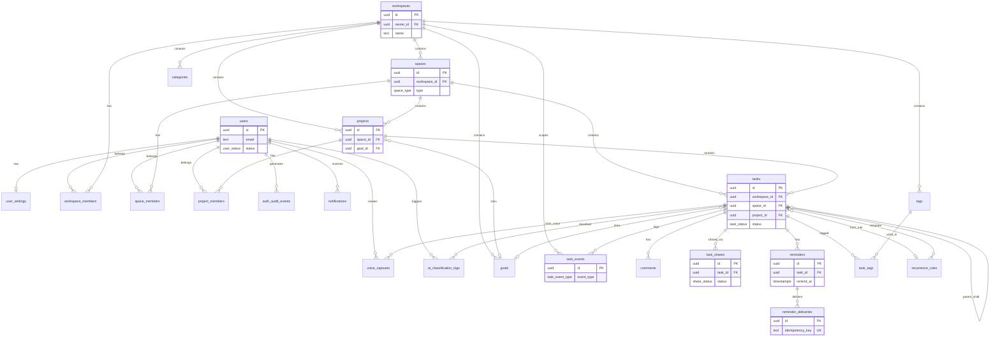

# DATA_MODEL.md

Версия: 0.2  
Статус: Draft — cross-doc consistency patch after AI_CONTRACTS v0.2 review  
Проект: AI Task Assistant / Time Management System  
Локальный путь: `C:\Dima\Projects\CURSOR\time-management`  
Связанные документы: `docs/TZ_MVP.md`, `docs/ARCHITECTURE_BASELINE.md`, `docs/AI_CONTRACTS.md`

---

## 1. Назначение документа

Данный документ определяет **модель данных MVP** для self-hosted системы управления задачами AI Task Assistant.

| Аспект | Описание |
| --- | --- |
| **Что определяет** | Таблицы, поля, типы, enum, PK/FK, constraints, индексы, политики soft delete / retention / privacy |
| **Для кого** | Backend-разработчик, DB architect, Cursor (ORM schema / migrations), Codex (review) |
| **Основа** | Следует `ARCHITECTURE_BASELINE.md` §4, §7, §8, §9, §10, §11, §12, §14, §17, §19, ADR-006..ADR-013 |
| **Что НЕ является** | SQL-миграцией, ORM schema, исполняемым кодом |

Документ является **источником истины** для проектирования PostgreSQL-схемы и последующих миграций в `packages/db`.

---

## 2. Data Model Principles

1. **PostgreSQL-first** — целевая СУБД PostgreSQL 15+; использование нативных enum, `timestamptz`, `jsonb`, partial unique indexes.
2. **UUID primary keys** — все публичные resource ID — UUID; не auto-increment integer.
3. **`workspace_id` как основной scope** — все доменные сущности (кроме `users`, `user_settings`) привязаны к workspace.
4. **Strict privacy by default** — private tasks недоступны без явного ACL; Owner не видит чужие private tasks (strict mode).
5. **Backend ACL, not frontend ACL** — видимость определяется predicate на уровне API/Domain, не UI.
6. **Soft delete для пользовательских сущностей** — `deleted_at` / `archived_at`; физическое удаление только для retention cleanup.
7. **Append-only audit/event log** — `task_events`, `auth_audit_events` не обновляются и не удаляются в MVP.
8. **UTC timestamps in DB** — все `timestamptz` хранятся в UTC; конвертация в user timezone только на read/display.
9. **User timezone only for display and daily boundaries** — source of truth: `user_settings.timezone` (ADR-012).
10. **AI raw payload retention-limited** — encrypted raw fields с `retention_until`; purge после истечения.
11. **No private content in cross-user analytics** — агрегации без title/description; private tasks исключены из shared analytics (ADR-013).
12. **Worker jobs must be idempotent** — `worker_job_locks.lock_key` unique; `reminder_deliveries.idempotency_key` unique.
13. **All task mutations must create `task_events` in the same transaction** — ADR-009; rollback откатывает и task, и event.

---

## 3. Global Conventions

### 3.1 ID strategy

- UUID v4 для всех основных таблиц: `uuid PRIMARY KEY DEFAULT gen_random_uuid()`.
- Альтернатива: UUID генерируется ORM на application layer — допустимо, если консистентно.
- **Не использовать** auto-increment integer для публичных resource IDs (IDOR enumeration risk).

### 3.2 Timestamp strategy

Все временные поля — тип **`timestamptz`**, хранение в UTC:

| Поле | Использование |
| --- | --- |
| `created_at` | Момент создания записи |
| `updated_at` | Последнее обновление (где применимо) |
| `deleted_at` | Soft delete |
| `completed_at` | Завершение задачи |
| `due_at` | Дедлайн задачи |
| `scheduled_for` | Запланированное время выполнения |
| `remind_at` | Время напоминания |
| `retention_until` | Срок хранения sensitive payload |
| `locked_until` | Lease worker lock |
| `sent_at` | Успешная доставка reminder/notification |

Default: `created_at NOT NULL DEFAULT now()`, `updated_at` обновляется триггером или application layer.

### 3.3 Soft delete strategy

| Механизм | Сущности |
| --- | --- |
| `deleted_at` (+ опционально `deleted_by`) | `tasks`, `projects`, `comments` |
| `archived_at` | `users` (via status), `workspaces`, `spaces`, `projects`, `goals` |
| `status` enum transitions | `member_status.removed`, `share_status.revoked`, `user_status.disabled/archived` |

Физическое удаление (hard delete / purge) — **только** для:
- expired AI raw encrypted payloads;
- expired voice audio blobs;
- expired notifications;
- expired worker locks;
- auth audit events после retention policy.

### 3.4 Enum naming

- PostgreSQL `CREATE TYPE ... AS ENUM` или check-constrained `text`.
- Все значения — **lowercase snake_case**.
- Имена типов — **snake_case** без префикса (например, `task_status`, не `TaskStatus`).

### 3.5 JSON fields

JSONB использовать **только** для переменной структуры:

| Таблица | Поле | Назначение |
| --- | --- | --- |
| `user_settings` | `notification_preferences` | Настройки каналов |
| `workspaces` | `settings` | Workspace-level config |
| `task_events` | `old_value`, `new_value`, `metadata` | Event diff |
| `notifications` | `payload` | IDs-only: task_id, comment_id, reminder_id, actor_user_id, action/type — no private content |
| `ai_classification_logs` | `output_json_redacted` | Redacted AI output |
| `auth_audit_events` | `metadata` | Redacted auth context |

**Не использовать** JSONB вместо нормализованных связей для core entities (tasks, users, spaces).

---

## 4. Enum Catalog

```sql
-- Пример DDL; финальный синтаксис — в миграциях

CREATE TYPE user_status AS ENUM ('active', 'invited', 'disabled', 'archived');
CREATE TYPE workspace_role AS ENUM ('owner', 'admin', 'member', 'guest');
CREATE TYPE space_type AS ENUM ('private', 'family', 'work', 'partners', 'public_limited', 'system');
CREATE TYPE space_visibility AS ENUM ('private', 'members', 'restricted');
CREATE TYPE member_role AS ENUM ('owner', 'admin', 'member', 'guest');
CREATE TYPE member_status AS ENUM ('active', 'invited', 'suspended', 'removed');
CREATE TYPE project_status AS ENUM ('active', 'paused', 'completed', 'archived');
CREATE TYPE task_status AS ENUM ('inbox', 'planned', 'in_progress', 'waiting', 'done', 'canceled', 'archived');
CREATE TYPE task_visibility AS ENUM ('private', 'space', 'project', 'shared');
CREATE TYPE task_source AS ENUM ('manual', 'quick_add', 'voice', 'ai', 'recurrence', 'import_future');
CREATE TYPE eisenhower_quadrant AS ENUM (
  'important_urgent', 'important_not_urgent',
  'not_important_urgent', 'not_important_not_urgent'
);
CREATE TYPE share_permission AS ENUM ('read', 'comment', 'complete');
CREATE TYPE share_status AS ENUM ('active', 'revoked', 'expired');
CREATE TYPE reminder_channel AS ENUM (
  'in_app', 'web_push_future', 'email_future',
  'mobile_push_future', 'telegram_future'
);
CREATE TYPE reminder_status AS ENUM ('pending', 'sent', 'failed', 'canceled', 'skipped');
CREATE TYPE delivery_status AS ENUM ('pending', 'processing', 'sent', 'failed', 'skipped', 'canceled');
CREATE TYPE recurrence_type AS ENUM ('daily', 'weekly', 'monthly', 'yearly', 'custom');
CREATE TYPE task_event_type AS ENUM (
  'task_created', 'task_updated', 'task_completed', 'task_reopened',
  'task_rescheduled', 'task_deleted', 'task_restored', 'task_delegated',
  'task_moved_to_space', 'task_moved_to_project', 'priority_changed',
  'quadrant_changed', 'reminder_created', 'reminder_sent',
  'recurrence_generated', 'ai_classified', 'ai_classification_corrected',
  'comment_added'
);
CREATE TYPE ai_sensitivity_level AS ENUM ('low', 'medium', 'high');
CREATE TYPE voice_capture_status AS ENUM ('uploaded', 'transcribed', 'classified', 'failed', 'purged');
CREATE TYPE worker_lock_status AS ENUM ('active', 'released', 'expired', 'failed');
CREATE TYPE auth_audit_event_type AS ENUM (
  'login_success', 'login_failed', 'logout',
  'password_changed', 'user_invited', 'user_disabled', 'session_revoked'
);
CREATE TYPE notification_type AS ENUM (
  'task_assigned', 'reminder_due', 'task_overdue',
  'comment_added', 'task_rescheduled', 'evening_review_pending'
);
CREATE TYPE goal_horizon AS ENUM ('five_years', 'year', 'quarter', 'month', 'week');
CREATE TYPE goal_status AS ENUM ('draft', 'active', 'paused', 'completed', 'archived');
```

### Сводная таблица enum

| Enum | Значения |
| --- | --- |
| `user_status` | active, invited, disabled, archived |
| `workspace_role` | owner, admin, member, guest |
| `space_type` | private, family, work, partners, public_limited, system |
| `space_visibility` | private, members, restricted |
| `member_role` | owner, admin, member, guest |
| `member_status` | active, invited, suspended, removed |
| `project_status` | active, paused, completed, archived |
| `task_status` | inbox, planned, in_progress, waiting, done, canceled, archived |
| `task_visibility` | private, space, project, shared |
| `task_source` | manual, quick_add, voice, ai, recurrence, import_future |
| `eisenhower_quadrant` | important_urgent, important_not_urgent, not_important_urgent, not_important_not_urgent |
| `share_permission` | read, comment, complete |
| `share_status` | active, revoked, expired |
| `reminder_channel` | in_app, web_push_future, email_future, mobile_push_future, telegram_future |
| `reminder_status` | pending, sent, failed, canceled, skipped |
| `delivery_status` | pending, processing, sent, failed, skipped, canceled |
| `recurrence_type` | daily, weekly, monthly, yearly, custom |
| `task_event_type` | см. DDL выше (19 значений) |
| `ai_sensitivity_level` | low, medium, high |
| `voice_capture_status` | uploaded, transcribed, classified, failed, purged |
| `worker_lock_status` | active, released, expired, failed |
| `auth_audit_event_type` | login_success, login_failed, logout, password_changed, user_invited, user_disabled, session_revoked |
| `notification_type` | task_assigned, reminder_due, task_overdue, comment_added, task_rescheduled, evening_review_pending |
| `goal_horizon` | five_years, year, quarter, month, week |
| `goal_status` | draft, active, paused, completed, archived |

---

## 5. Entity Relationship Overview



---

## 6. Table Definitions

### users

**Purpose:** Учётная запись пользователя в системе. MVP: один workspace на инсталляцию; email уникален глобально.

**Fields:**

| Field | Type | Nullable | Default | Description |
| --- | --- | ---: | --- | --- |
| id | uuid | NO | gen_random_uuid() | Primary key |
| email | text | NO | — | Email для login |
| password_hash | text | YES | — | bcrypt/argon2 hash; NULL если external auth (future) |
| name | text | NO | — | Отображаемое имя |
| avatar_url | text | YES | — | URL аватара |
| status | user_status | NO | active | Статус учётной записи |
| created_at | timestamptz | NO | now() | — |
| updated_at | timestamptz | NO | now() | — |
| disabled_at | timestamptz | YES | — | Момент деактивации |
| archived_at | timestamptz | YES | — | Момент архивации |

**Primary key:** `id`

**Foreign keys:** —

**Unique constraints:**
- `UNIQUE (lower(email))` — case-insensitive email uniqueness

**Check constraints:**
- `password_hash` никогда не содержит plaintext (application-level; DB: `length(password_hash) >= 60` если NOT NULL)
- `disabled_at IS NOT NULL` когда `status = disabled`
- `archived_at IS NOT NULL` когда `status = archived`

**Indexes:**
- `users_email_unique_idx` ON `lower(email)` UNIQUE
- `users_status_idx` ON `(status)`

**Lifecycle:** active → disabled → archived; login blocked при disabled/archived.

**Privacy / Security:** password_hash never exposed via API; email visible to workspace members per ACL.

**Notes:** timezone и locale — legacy nullable поля **не добавляются** в `users`; source of truth — `user_settings`.

---

### user_settings

**Purpose:** Персональные настройки пользователя (1:1 с users). Определяет timezone для Today/Evening Review (ADR-012).

**Fields:**

| Field | Type | Nullable | Default | Description |
| --- | --- | ---: | --- | --- |
| user_id | uuid | NO | — | PK + FK → users.id |
| timezone | text | NO | 'Europe/Moscow' | IANA timezone |
| locale | text | NO | 'ru' | BCP-47 locale |
| notification_preferences | jsonb | NO | '{}' | Каналы, quiet hours |
| ai_confirmation_mode | text | NO | 'confirm_on_low_confidence' | Режим подтверждения AI |
| ai_confidence_threshold | numeric(3,2) | NO | 0.75 | Порог confidence (0–1) |
| morning_digest_time | time | YES | — | Время утренней сводки (local) |
| evening_review_time | time | YES | — | Время вечернего отчёта (local) |
| created_at | timestamptz | NO | now() | — |
| updated_at | timestamptz | NO | now() | — |

**Primary key:** `user_id`

**Foreign keys:**
- `user_id` → `users(id)` ON DELETE CASCADE

**Unique constraints:** — (PK)

**Check constraints:**
- `ai_confidence_threshold BETWEEN 0 AND 1`
- `length(trim(timezone)) > 0`
- `ai_confirmation_mode IN ('always_confirm', 'confirm_on_low_confidence', 'never_confirm')` — уточнить в API_CONTRACTS

**Indexes:**
- PK на `user_id`

**Lifecycle:** Создаётся вместе с user (seed / registration).

**Privacy / Security:** Доступ только самому user; Owner — admin mode без sensitive prefs.

**Notes:** `morning_digest_time` / `evening_review_time` — local time без timezone (интерпретируется в `timezone`).

---

### workspaces

**Purpose:** Логическая инсталляция self-hosted системы. MVP: одна workspace на deployment.

**Fields:**

| Field | Type | Nullable | Default | Description |
| --- | --- | ---: | --- | --- |
| id | uuid | NO | gen_random_uuid() | Primary key |
| name | text | NO | — | Название workspace |
| owner_id | uuid | NO | — | FK → users (workspace Owner) |
| default_timezone | text | NO | 'Europe/Moscow' | Default TZ для новых users |
| settings | jsonb | NO | '{}' | Workspace config |
| created_at | timestamptz | NO | now() | — |
| updated_at | timestamptz | NO | now() | — |
| archived_at | timestamptz | YES | — | Архивация workspace |

**Primary key:** `id`

**Foreign keys:**
- `owner_id` → `users(id)` ON DELETE RESTRICT

**Unique constraints:** —

**Check constraints:**
- `owner_id` required (NOT NULL enforced)
- `length(trim(name)) > 0`

**Indexes:**
- `workspaces_owner_id_idx` ON `(owner_id)`

**Lifecycle:** Single workspace convention для MVP.

**Privacy / Security:** settings не содержат secrets (только в env).

**Notes:** Все доменные таблицы scoped через `workspace_id`.

---

### workspace_members

**Purpose:** Членство пользователя в workspace с ролью.

**Fields:**

| Field | Type | Nullable | Default | Description |
| --- | --- | ---: | --- | --- |
| id | uuid | NO | gen_random_uuid() | Primary key |
| workspace_id | uuid | NO | — | FK → workspaces |
| user_id | uuid | NO | — | FK → users |
| role | workspace_role | NO | — | owner, admin, member, guest |
| status | member_status | NO | active | Статус членства |
| invited_by | uuid | YES | — | FK → users |
| joined_at | timestamptz | YES | — | Момент принятия приглашения |
| created_at | timestamptz | NO | now() | — |
| updated_at | timestamptz | NO | now() | — |

**Primary key:** `id`

**Foreign keys:**
- `workspace_id` → `workspaces(id)` ON DELETE CASCADE
- `user_id` → `users(id)` ON DELETE CASCADE
- `invited_by` → `users(id)` ON DELETE SET NULL

**Unique constraints:**
- `UNIQUE (workspace_id, user_id)`

**Partial unique indexes (ACL / business rules):**
```sql
CREATE UNIQUE INDEX workspace_members_one_owner_idx
  ON workspace_members (workspace_id)
  WHERE role = 'owner' AND status = 'active';
```
```sql
CREATE UNIQUE INDEX workspace_members_active_membership_idx
  ON workspace_members (workspace_id, user_id)
  WHERE status = 'active';
```

**Check constraints:** —

**Indexes:**
- `workspace_members_workspace_id_idx` ON `(workspace_id)`
- `workspace_members_user_id_idx` ON `(user_id)`
- `workspace_members_role_idx` ON `(role)`
- `workspace_members_status_idx` ON `(status)`
- `workspace_members_workspace_user_status_idx` ON `(workspace_id, user_id, status)`

**Lifecycle:** invited → active; active → suspended → removed.

**Privacy / Security:** Только active membership учитывается в ACL.

**Notes:** Один owner per workspace — partial unique index + business rule.

---

### spaces

**Purpose:** Логическая область видимости задач (Личное, Семья, Работа, …).

**Fields:**

| Field | Type | Nullable | Default | Description |
| --- | --- | ---: | --- | --- |
| id | uuid | NO | gen_random_uuid() | Primary key |
| workspace_id | uuid | NO | — | FK → workspaces |
| name | text | NO | — | Отображаемое имя |
| type | space_type | NO | — | Тип пространства |
| visibility | space_visibility | NO | members | Уровень видимости |
| created_by | uuid | NO | — | FK → users |
| created_at | timestamptz | NO | now() | — |
| updated_at | timestamptz | NO | now() | — |
| archived_at | timestamptz | YES | — | Архивация |

**Primary key:** `id`

**Foreign keys:**
- `workspace_id` → `workspaces(id)` ON DELETE CASCADE
- `created_by` → `users(id)` ON DELETE RESTRICT

**Unique constraints:**
- `UNIQUE (workspace_id, name)`

**Check constraints:**
- `length(trim(name)) > 0`

**Indexes:**
- `spaces_workspace_id_idx` ON `(workspace_id)`
- `spaces_type_idx` ON `(type)`
- `spaces_visibility_idx` ON `(visibility)`

**Lifecycle:** System spaces (Inbox) создаются seed; `type = system` для «Входящие».

**Privacy / Security:**
- `type = private` — convention: один private space per user (application rule, не DB constraint)
- `type = system` — Inbox; видимость только создателю до классификации

**Notes:** Seed создаёт 6 default spaces (см. §12).

---

### space_members

**Purpose:** Членство пользователя в пространстве.

**Fields:**

| Field | Type | Nullable | Default | Description |
| --- | --- | ---: | --- | --- |
| id | uuid | NO | gen_random_uuid() | Primary key |
| space_id | uuid | NO | — | FK → spaces |
| user_id | uuid | NO | — | FK → users |
| role | member_role | NO | member | Роль в space |
| status | member_status | NO | active | Статус |
| invited_by | uuid | YES | — | FK → users |
| joined_at | timestamptz | YES | — | — |
| created_at | timestamptz | NO | now() | — |
| updated_at | timestamptz | NO | now() | — |

**Primary key:** `id`

**Foreign keys:**
- `space_id` → `spaces(id)` ON DELETE CASCADE
- `user_id` → `users(id)` ON DELETE CASCADE
- `invited_by` → `users(id)` ON DELETE SET NULL

**Unique constraints:**
- `UNIQUE (space_id, user_id)`

**Partial unique index:**
```sql
CREATE UNIQUE INDEX space_members_active_membership_idx
  ON space_members (space_id, user_id)
  WHERE status = 'active';
```

**Indexes:**
- `space_members_space_id_idx` ON `(space_id)`
- `space_members_user_id_idx` ON `(user_id)`
- `space_members_role_idx` ON `(role)`
- `space_members_status_idx` ON `(status)`
- `space_members_space_user_status_idx` ON `(space_id, user_id, status)`

**Lifecycle:** Только `status = active` grants space ACL.

**Privacy / Security:** Family member в family space не видит work space без membership.

**Notes:** —

---

### projects

**Purpose:** Группа задач внутри space с project-level ACL.

**Fields:**

| Field | Type | Nullable | Default | Description |
| --- | --- | ---: | --- | --- |
| id | uuid | NO | gen_random_uuid() | Primary key |
| workspace_id | uuid | NO | — | FK → workspaces |
| space_id | uuid | NO | — | FK → spaces |
| owner_id | uuid | NO | — | FK → users |
| goal_id | uuid | YES | — | FK → goals (future hook) |
| name | text | NO | — | Название проекта |
| description | text | YES | — | Описание |
| status | project_status | NO | active | Статус |
| start_date | date | YES | — | Дата начала |
| due_date | date | YES | — | Дедлайн проекта |
| created_at | timestamptz | NO | now() | — |
| updated_at | timestamptz | NO | now() | — |
| archived_at | timestamptz | YES | — | Архивация |
| deleted_at | timestamptz | YES | — | Soft delete |

**Primary key:** `id`

**Foreign keys:**
- `workspace_id` → `workspaces(id)` ON DELETE CASCADE
- `space_id` → `spaces(id)` ON DELETE RESTRICT
- `owner_id` → `users(id)` ON DELETE RESTRICT
- `goal_id` → `goals(id)` ON DELETE SET NULL

**Unique constraints:** —

**Check constraints:**
- `space_id` required
- `length(trim(name)) > 0`
- `start_date <= due_date` (если оба заданы)

**Indexes:**
- `projects_workspace_id_idx` ON `(workspace_id)`
- `projects_space_id_idx` ON `(space_id)`
- `projects_owner_id_idx` ON `(owner_id)`
- `projects_status_idx` ON `(status)`
- `projects_due_date_idx` ON `(due_date)`
- `projects_goal_id_idx` ON `(goal_id)`
- `projects_deleted_at_idx` ON `(deleted_at)` WHERE `deleted_at IS NULL` (partial)

**Lifecycle:** Soft delete via `deleted_at`; archived via `archived_at` или `status = archived`.

**Privacy / Security:** Domain invariant: `task.space_id` must equal `project.space_id` when `task.project_id` set.

**Notes:** `goal_id` nullable — UI goals вне MVP.

---

### project_members

**Purpose:** Участник проекта с project-level правами (ADR-006).

**Fields:**

| Field | Type | Nullable | Default | Description |
| --- | --- | ---: | --- | --- |
| id | uuid | NO | gen_random_uuid() | Primary key |
| project_id | uuid | NO | — | FK → projects |
| user_id | uuid | NO | — | FK → users |
| role | member_role | NO | member | Роль |
| status | member_status | NO | active | Статус |
| invited_by | uuid | YES | — | FK → users |
| joined_at | timestamptz | YES | — | — |
| created_at | timestamptz | NO | now() | — |
| updated_at | timestamptz | NO | now() | — |

**Primary key:** `id`

**Foreign keys:**
- `project_id` → `projects(id)` ON DELETE CASCADE
- `user_id` → `users(id)` ON DELETE CASCADE
- `invited_by` → `users(id)` ON DELETE SET NULL

**Unique constraints:**
- `UNIQUE (project_id, user_id)`

**Partial unique index:**
```sql
CREATE UNIQUE INDEX project_members_active_membership_idx
  ON project_members (project_id, user_id)
  WHERE status = 'active';
```

**Indexes:**
- `project_members_project_id_idx` ON `(project_id)`
- `project_members_user_id_idx` ON `(user_id)`
- `project_members_role_idx` ON `(role)`
- `project_members_status_idx` ON `(status)`
- `project_members_project_user_status_idx` ON `(project_id, user_id, status)`

**Lifecycle:** Active project member grants project visibility only, not whole space.

**Privacy / Security:**

```text
ACCESS-ADR-001 is authoritative for MVP:
Project-only guest without active space membership is NOT allowed.
ProjectMember requires active SpaceMember for project.space_id.
External guests use TaskShare only.
```

- User **must** be active `SpaceMember` for `project.space_id` before `ProjectMember` insert.
- Work partner: space member of project space **and** `ProjectMember` (not project-only without space membership).

**Notes:** See `ACCESS_CONTROL.md` ACCESS-ADR-001 for Guest/TaskShare path.

---

### tasks

**Purpose:** Основная единица работы — задача.

**Fields:**

| Field | Type | Nullable | Default | Description |
| --- | --- | ---: | --- | --- |
| id | uuid | NO | gen_random_uuid() | Primary key |
| workspace_id | uuid | NO | — | FK → workspaces |
| space_id | uuid | NO | — | FK → spaces |
| project_id | uuid | YES | — | FK → projects |
| parent_task_id | uuid | YES | — | Self FK → tasks |
| goal_id | uuid | YES | — | FK → goals (future) |
| created_by | uuid | NO | — | FK → users |
| owner_id | uuid | NO | — | FK → users |
| assignee_id | uuid | YES | — | FK → users |
| category_id | uuid | YES | — | FK → categories |
| title | text | NO | — | Название (required) |
| description | text | YES | — | Описание |
| status | task_status | NO | inbox | Статус |
| visibility | task_visibility | NO | private | Видимость |
| source | task_source | NO | manual | Источник создания |
| importance_score | smallint | YES | — | 1–5 |
| urgency_score | smallint | YES | — | 1–5 |
| eisenhower_quadrant | eisenhower_quadrant | YES | — | Квадрант |
| due_at | timestamptz | YES | — | Дедлайн |
| scheduled_for | timestamptz | YES | — | Запланировано на |
| started_at | timestamptz | YES | — | Начало работы |
| completed_at | timestamptz | YES | — | Завершение |
| canceled_at | timestamptz | YES | — | Отмена |
| ai_confidence | numeric(3,2) | YES | — | Confidence AI |
| ai_classification_status | text | YES | — | pending, accepted, corrected |
| recurrence_rule_id | uuid | YES | — | FK → recurrence_rules (instance) |
| created_at | timestamptz | NO | now() | — |
| updated_at | timestamptz | NO | now() | — |
| deleted_at | timestamptz | YES | — | Soft delete |

**Primary key:** `id`

**Foreign keys:**
- `workspace_id` → `workspaces(id)` ON DELETE CASCADE
- `space_id` → `spaces(id)` ON DELETE RESTRICT
- `project_id` → `projects(id)` ON DELETE SET NULL
- `parent_task_id` → `tasks(id)` ON DELETE SET NULL
- `goal_id` → `goals(id)` ON DELETE SET NULL
- `created_by`, `owner_id`, `assignee_id` → `users(id)`
- `category_id` → `categories(id)` ON DELETE SET NULL
- `recurrence_rule_id` → `recurrence_rules(id)` ON DELETE SET NULL

**Unique constraints (recurrence idempotency):**
```sql
CREATE UNIQUE INDEX tasks_recurrence_instance_unique_idx
  ON tasks (recurrence_rule_id, scheduled_for)
  WHERE recurrence_rule_id IS NOT NULL
    AND scheduled_for IS NOT NULL
    AND deleted_at IS NULL;
```

**Check constraints:**
- `importance_score BETWEEN 1 AND 5` (если NOT NULL)
- `urgency_score BETWEEN 1 AND 5` (если NOT NULL)
- `ai_confidence BETWEEN 0 AND 1` (если NOT NULL)
- `length(trim(title)) > 0`
- `parent_task_id != id`
- `(status = 'done') = (completed_at IS NOT NULL)` — application-enforced; DB optional deferred
- `(status = 'canceled') IMPLIES (canceled_at IS NOT NULL)` — application-enforced

**Indexes:**
- `tasks_workspace_id_idx` ON `(workspace_id)`
- `tasks_space_id_idx` ON `(space_id)`
- `tasks_project_id_idx` ON `(project_id)`
- `tasks_parent_task_id_idx` ON `(parent_task_id)`
- `tasks_owner_id_idx` ON `(owner_id)`
- `tasks_assignee_id_idx` ON `(assignee_id)`
- `tasks_category_id_idx` ON `(category_id)`
- `tasks_status_idx` ON `(status)`
- `tasks_visibility_idx` ON `(visibility)`
- `tasks_due_at_idx` ON `(due_at)`
- `tasks_scheduled_for_idx` ON `(scheduled_for)`
- `tasks_eisenhower_quadrant_idx` ON `(eisenhower_quadrant)`
- `tasks_deleted_at_idx` ON `(deleted_at)` WHERE `deleted_at IS NULL` (partial active tasks)
- `tasks_workspace_status_due_idx` ON `(workspace_id, status, due_at)`
- `tasks_space_status_idx` ON `(space_id, status)`
- `tasks_project_status_idx` ON `(project_id, status)`
- `tasks_assignee_status_due_idx` ON `(assignee_id, status, due_at)`

**Lifecycle:** Soft delete; `deleted_at IS NOT NULL` → excluded from normal queries.

**Privacy / Security:** Все list/get queries применяют ACL predicate; private tasks excluded from shared analytics.

**Notes:** `project.space_id` must match `task.space_id` — domain invariant (trigger или application check).

---

### task_shares

**Purpose:** Точечный explicit share задачи для Guest без space membership (ADR-006). **Codex fix:** revoke lifecycle.

**Fields:**

| Field | Type | Nullable | Default | Description |
| --- | --- | ---: | --- | --- |
| id | uuid | NO | gen_random_uuid() | Primary key |
| task_id | uuid | NO | — | FK → tasks |
| shared_with_user_id | uuid | NO | — | FK → users |
| shared_by_user_id | uuid | NO | — | FK → users |
| permission | share_permission | NO | — | read, comment, complete |
| status | share_status | NO | active | active, revoked, expired |
| expires_at | timestamptz | YES | — | Auto-expire |
| revoked_at | timestamptz | YES | — | Момент отзыва |
| revoked_by | uuid | YES | — | FK → users |
| created_at | timestamptz | NO | now() | — |
| updated_at | timestamptz | NO | now() | — |

**Primary key:** `id`

**Foreign keys:**
- `task_id` → `tasks(id)` ON DELETE CASCADE
- `shared_with_user_id` → `users(id)` ON DELETE CASCADE
- `shared_by_user_id` → `users(id)` ON DELETE RESTRICT
- `revoked_by` → `users(id)` ON DELETE SET NULL

**Unique constraints:**
```sql
CREATE UNIQUE INDEX task_shares_active_unique_idx
  ON task_shares (task_id, shared_with_user_id)
  WHERE status = 'active';
```
**Обоснование:** один active share per task/user; при смене permission — revoke старый + create новый.

**Check constraints:**
- `status = 'revoked' IMPLIES revoked_at IS NOT NULL`
- `status = 'expired' IMPLIES expires_at IS NOT NULL AND expires_at <= now()` — enforced by worker/job
- active share: `revoked_at IS NULL`

**Indexes:**
- `task_shares_task_id_idx` ON `(task_id)`
- `task_shares_shared_with_user_id_idx` ON `(shared_with_user_id)`
- `task_shares_shared_by_user_id_idx` ON `(shared_by_user_id)`
- `task_shares_status_idx` ON `(status)`
- `task_shares_expires_at_idx` ON `(expires_at)` WHERE `status = 'active'`

**Lifecycle:**
- `active` → `revoked` (manual revoke: set `revoked_at`, `revoked_by`, `status`)
- `active` → `expired` (worker при `expires_at < now()`)
- Revoked/expired share invalid immediately for ACL

**Privacy / Security:** Grants access only to this task; no project/space inheritance; private task share only by owner.

**Notes:** Guest primary path; не заменяет SpaceMember/ProjectMember.

---

### comments

**Purpose:** Комментарий к задаче (MVP entity, ADR-006).

**Fields:**

| Field | Type | Nullable | Default | Description |
| --- | --- | ---: | --- | --- |
| id | uuid | NO | gen_random_uuid() | Primary key |
| task_id | uuid | NO | — | FK → tasks |
| author_id | uuid | NO | — | FK → users |
| body | text | NO | — | Текст комментария |
| created_at | timestamptz | NO | now() | — |
| updated_at | timestamptz | NO | now() | — |
| deleted_at | timestamptz | YES | — | Soft delete |

**Primary key:** `id`

**Foreign keys:**
- `task_id` → `tasks(id)` ON DELETE CASCADE
- `author_id` → `users(id)` ON DELETE RESTRICT

**Unique constraints:** —

**Check constraints:**
- `length(trim(body)) > 0` (если not deleted)

**Indexes:**
- `comments_task_id_idx` ON `(task_id)`
- `comments_author_id_idx` ON `(author_id)`
- `comments_created_at_idx` ON `(created_at)`
- `comments_deleted_at_idx` ON `(deleted_at)` WHERE `deleted_at IS NULL`

**Lifecycle:** Soft delete; `comment_added` TaskEvent stores `comment_id`, not body.

**Privacy / Security:** Body never in analytics or unauthorized notification payload.

**Notes:** —

---

### categories

**Purpose:** Классификация задач на уровне workspace.

**Fields:**

| Field | Type | Nullable | Default | Description |
| --- | --- | ---: | --- | --- |
| id | uuid | NO | gen_random_uuid() | Primary key |
| workspace_id | uuid | NO | — | FK → workspaces |
| name | text | NO | — | Название |
| color | text | YES | — | HEX или token |
| icon | text | YES | — | Icon identifier |
| created_by | uuid | YES | — | FK → users |
| created_at | timestamptz | NO | now() | — |
| updated_at | timestamptz | NO | now() | — |

**Primary key:** `id`

**Foreign keys:**
- `workspace_id` → `workspaces(id)` ON DELETE CASCADE
- `created_by` → `users(id)` ON DELETE SET NULL

**Unique constraints:**
- `UNIQUE (workspace_id, lower(name))`

**Indexes:**
- `categories_workspace_id_idx` ON `(workspace_id)`
- `categories_name_idx` ON `(workspace_id, lower(name))`

**Lifecycle:** Seed default categories (§12).

**Privacy / Security:** Workspace-scoped; visible to all workspace members.

**Notes:** —

---

### tags

**Purpose:** Гибкие метки задач.

**Fields:**

| Field | Type | Nullable | Default | Description |
| --- | --- | ---: | --- | --- |
| id | uuid | NO | gen_random_uuid() | Primary key |
| workspace_id | uuid | NO | — | FK → workspaces |
| name | text | NO | — | Название тега |
| created_at | timestamptz | NO | now() | — |
| updated_at | timestamptz | NO | now() | — |

**Primary key:** `id`

**Foreign keys:**
- `workspace_id` → `workspaces(id)` ON DELETE CASCADE

**Unique constraints:**
- `UNIQUE (workspace_id, lower(name))`

**Indexes:**
- `tags_workspace_id_idx` ON `(workspace_id)`

**Lifecycle:** —

**Privacy / Security:** —

**Notes:** —

---

### task_tags

**Purpose:** M:N связь Task ↔ Tag.

**Fields:**

| Field | Type | Nullable | Default | Description |
| --- | --- | ---: | --- | --- |
| task_id | uuid | NO | — | FK → tasks |
| tag_id | uuid | NO | — | FK → tags |
| created_at | timestamptz | NO | now() | — |

**Primary key:** `(task_id, tag_id)`

**Foreign keys:**
- `task_id` → `tasks(id)` ON DELETE CASCADE
- `tag_id` → `tags(id)` ON DELETE CASCADE

**Indexes:**
- `task_tags_tag_id_idx` ON `(tag_id)`

**Lifecycle:** —

**Privacy / Security:** —

**Notes:** —

---

### reminders

**Purpose:** Запланированное напоминание о задаче.

**Fields:**

| Field | Type | Nullable | Default | Description |
| --- | --- | ---: | --- | --- |
| id | uuid | NO | gen_random_uuid() | Primary key |
| task_id | uuid | NO | — | FK → tasks |
| user_id | uuid | NO | — | FK → users (получатель) |
| remind_at | timestamptz | NO | — | Время напоминания (UTC) |
| channel | reminder_channel | NO | in_app | Канал |
| status | reminder_status | NO | pending | Статус |
| sent_at | timestamptz | YES | — | Успешная отправка |
| canceled_at | timestamptz | YES | — | Отмена |
| created_at | timestamptz | NO | now() | — |
| updated_at | timestamptz | NO | now() | — |

**Primary key:** `id`

**Foreign keys:**
- `task_id` → `tasks(id)` ON DELETE CASCADE
- `user_id` → `users(id)` ON DELETE CASCADE

**Partial unique index (idempotency candidate):**
```sql
CREATE UNIQUE INDEX reminders_active_idempotency_idx
  ON reminders (task_id, user_id, remind_at, channel)
  WHERE status NOT IN ('canceled');
```

**Check constraints:**
- User must have access to task when reminder created (application)
- `status = 'sent' IMPLIES sent_at IS NOT NULL`

**Indexes:**
- `reminders_task_id_idx` ON `(task_id)`
- `reminders_user_id_idx` ON `(user_id)`
- `reminders_remind_at_idx` ON `(remind_at)`
- `reminders_status_idx` ON `(status)`
- `reminders_status_remind_at_idx` ON `(status, remind_at)`

**Lifecycle:** pending → sent | failed | canceled | skipped; cancel if task done/canceled.

**Privacy / Security:** —

**Notes:** Worker polls `status = pending AND remind_at <= now()`.

---

### reminder_deliveries

**Purpose:** Попытка доставки reminder с idempotency и retry (ADR-008). **Codex fix:** retry scheduling fields.

**Fields:**

| Field | Type | Nullable | Default | Description |
| --- | --- | ---: | --- | --- |
| id | uuid | NO | gen_random_uuid() | Primary key |
| reminder_id | uuid | NO | — | FK → reminders |
| user_id | uuid | NO | — | FK → users |
| channel | reminder_channel | NO | — | Канал доставки |
| idempotency_key | text | NO | — | Unique delivery key |
| attempt | integer | NO | 1 | Номер попытки |
| status | delivery_status | NO | pending | Статус доставки |
| error_message | text | YES | — | Redacted error |
| last_attempt_at | timestamptz | YES | — | Последняя попытка |
| next_retry_at | timestamptz | YES | — | Следующий retry |
| sent_at | timestamptz | YES | — | Успех |
| created_at | timestamptz | NO | now() | — |
| updated_at | timestamptz | NO | now() | — |

**Primary key:** `id`

**Foreign keys:**
- `reminder_id` → `reminders(id)` ON DELETE CASCADE
- `user_id` → `users(id)` ON DELETE CASCADE

**Unique constraints:**
- `UNIQUE (idempotency_key)`

**Check constraints:**
- `attempt >= 1`
- `status = 'sent' IMPLIES sent_at IS NOT NULL`
- sent delivery never resent (terminal state)
- Transition rules (application-enforced):
  - pending → processing
  - processing → sent | failed
  - failed → pending (if retry allowed, update `next_retry_at`)
  - sent, canceled — terminal

**Indexes:**
- `reminder_deliveries_reminder_id_idx` ON `(reminder_id)`
- `reminder_deliveries_user_id_idx` ON `(user_id)`
- `reminder_deliveries_status_idx` ON `(status)`
- `reminder_deliveries_next_retry_at_idx` ON `(next_retry_at)`
- `reminder_deliveries_idempotency_key_unique` ON `(idempotency_key)` UNIQUE
- `reminder_deliveries_status_next_retry_idx` ON `(status, next_retry_at)`

**Lifecycle:**
```
idempotency_key = '{reminder_id}:{channel}:{remind_at_iso}'
Backoff: attempt 1 immediate, 2 → +1min, 3 → +5min, 4+ → failed
```

**Privacy / Security:** error_message redacted; no task title in error logs.

**Notes:** Worker claims `pending` → `processing` atomically (UPDATE … WHERE status = pending RETURNING).

---

### recurrence_rules

**Purpose:** Правило повторения задачи.

**Fields:**

| Field | Type | Nullable | Default | Description |
| --- | --- | ---: | --- | --- |
| id | uuid | NO | gen_random_uuid() | Primary key |
| template_task_id | uuid | NO | — | FK → tasks (шаблон) |
| rule_type | recurrence_type | NO | — | Тип повтора |
| interval | integer | NO | 1 | Интервал |
| days_of_week | integer[] | YES | — | 0=Sun..6=Sat |
| day_of_month | integer | YES | — | 1–31 |
| end_date | timestamptz | YES | — | Окончание правила |
| max_occurrences | integer | YES | — | Лимит вхождений |
| occurrences_created | integer | NO | 0 | Счётчик |
| next_run_at | timestamptz | NO | — | Следующий запуск (UTC) |
| status | text | NO | active | active, paused, completed |
| created_at | timestamptz | NO | now() | — |
| updated_at | timestamptz | NO | now() | — |

**Primary key:** `id`

**Foreign keys:**
- `template_task_id` → `tasks(id)` ON DELETE CASCADE

**Partial unique index:**
```sql
CREATE UNIQUE INDEX recurrence_rules_one_active_per_template_idx
  ON recurrence_rules (template_task_id)
  WHERE status = 'active';
```

**Check constraints:**
- `interval >= 1`
- `day_of_month BETWEEN 1 AND 31` (если NOT NULL)
- `occurrences_created >= 0`

**Indexes:**
- `recurrence_rules_template_task_id_idx` ON `(template_task_id)`
- `recurrence_rules_status_idx` ON `(status)`
- `recurrence_rules_next_run_at_idx` ON `(next_run_at)`
- `recurrence_rules_status_next_run_idx` ON `(status, next_run_at)`

**Lifecycle:** Worker generates instances; duplicate prevention via `tasks_recurrence_instance_unique_idx`.

**Privacy / Security:** —

**Notes:** Instance tasks reference `recurrence_rule_id`; template task holds the rule via `recurrence_rules.template_task_id`.

---

### worker_job_locks

**Purpose:** DB-backed lease lock для worker jobs (ADR-008).

**Fields:**

| Field | Type | Nullable | Default | Description |
| --- | --- | ---: | --- | --- |
| id | uuid | NO | gen_random_uuid() | Primary key |
| job_type | text | NO | — | reminder, recurrence, cleanup, … |
| resource_id | uuid | YES | — | ID ресурса (reminder_id, rule_id) |
| lock_key | text | NO | — | Unique lock identifier |
| locked_by | text | YES | — | Worker instance id |
| locked_until | timestamptz | NO | — | Lease expiry |
| status | worker_lock_status | NO | active | active, released, expired, failed |
| created_at | timestamptz | NO | now() | — |
| updated_at | timestamptz | NO | now() | — |

**Primary key:** `id`

**Foreign keys:** —

**Unique constraints:**
- `UNIQUE (lock_key)`

**Check constraints:**
- `locked_until IS NOT NULL`
- `length(trim(lock_key)) > 0`

**Indexes:**
- `worker_job_locks_lock_key_unique` ON `(lock_key)` UNIQUE
- `worker_job_locks_locked_until_idx` ON `(locked_until)`
- `worker_job_locks_status_idx` ON `(status)`
- `worker_job_locks_status_locked_until_idx` ON `(status, locked_until)`

**Lifecycle:** Expired locks (`locked_until < now()`) can be re-acquired; cleanup job purges stale locks.

**Privacy / Security:** —

**Notes:** `lock_key` examples: `reminder:{id}`, `recurrence:{rule_id}`, `batch:reminders`.

---

### task_events

**Purpose:** Append-only audit log изменений задачи (ADR-003, ADR-009).

**Fields:**

| Field | Type | Nullable | Default | Description |
| --- | --- | ---: | --- | --- |
| id | uuid | NO | gen_random_uuid() | Primary key |
| workspace_id | uuid | NO | — | FK → workspaces |
| task_id | uuid | NO | — | FK → tasks |
| user_id | uuid | YES | — | FK → users (NULL для system/worker) |
| event_type | task_event_type | NO | — | Тип события |
| old_value | jsonb | YES | — | Предыдущее состояние |
| new_value | jsonb | YES | — | Новое состояние |
| metadata | jsonb | YES | — | Доп. данные |
| created_at | timestamptz | NO | now() | — |

**Primary key:** `id`

**Foreign keys:**
- `workspace_id` → `workspaces(id)` ON DELETE CASCADE
- `task_id` → `tasks(id)` ON DELETE CASCADE
- `user_id` → `users(id)` ON DELETE SET NULL

**Unique constraints:** —

**Check constraints:**
- Append-only: no UPDATE/DELETE from application (revoke privileges or RLS)
- `comment_added` metadata: `{ "comment_id": "uuid" }` — no body
- `ai_classified` metadata: AI log id / summary — no raw private prompt

**Indexes:**
- `task_events_workspace_id_idx` ON `(workspace_id)`
- `task_events_task_id_idx` ON `(task_id)`
- `task_events_user_id_idx` ON `(user_id)`
- `task_events_event_type_idx` ON `(event_type)`
- `task_events_created_at_idx` ON `(created_at)`
- `task_events_task_created_idx` ON `(task_id, created_at)`
- `task_events_workspace_type_created_idx` ON `(workspace_id, event_type, created_at)`

**Lifecycle:** Immutable in MVP; no retention purge.

**Privacy / Security:** old_value/new_value не содержат private content для cross-user queries.

**Notes:** Must be written in same transaction as task mutation.

---

### ai_classification_logs

**Purpose:** Privacy-safe журнал AI-решений (ADR-007). **Codex fix:** retention fields and indexes.

**Fields:**

| Field | Type | Nullable | Default | Description |
| --- | --- | ---: | --- | --- |
| id | uuid | NO | gen_random_uuid() | Primary key |
| task_id | uuid | YES | — | FK → tasks (nullable до создания task) |
| user_id | uuid | NO | — | FK → users |
| model_name | text | NO | — | Имя модели |
| provider | text | NO | — | Провайдер |
| input_text_redacted | text | YES | — | Redacted input |
| output_json_redacted | jsonb | YES | — | Redacted output |
| raw_input_encrypted | bytea | YES | — | Encrypted raw (optional) |
| raw_output_encrypted | bytea | YES | — | Encrypted raw (optional) |
| provider_payload_hash | text | YES | — | Hash для debug |
| confidence | numeric(3,2) | YES | — | 0–1 |
| accepted_by_user | boolean | YES | — | Принято пользователем |
| corrected_by_user | boolean | YES | — | Исправлено |
| sensitivity_level | ai_sensitivity_level | NO | medium | Уровень чувствительности |
| error_code | text | YES | — | Код ошибки |
| error_message_redacted | text | YES | — | Redacted error |
| retention_until | timestamptz | YES | — | Purge raw после этой даты |
| created_at | timestamptz | NO | now() | — |

**Primary key:** `id`

**Foreign keys:**
- `task_id` → `tasks(id)` ON DELETE SET NULL
- `user_id` → `users(id)` ON DELETE CASCADE

**Check constraints:**
- `confidence BETWEEN 0 AND 1` (если NOT NULL)
- `raw_*_encrypted IS NOT NULL IMPLIES retention_until IS NOT NULL`
- Tech audit cannot expose raw fields (application policy)

**Indexes:**
- `ai_classification_logs_task_id_idx` ON `(task_id)`
- `ai_classification_logs_user_id_idx` ON `(user_id)`
- `ai_classification_logs_provider_idx` ON `(provider)`
- `ai_classification_logs_model_name_idx` ON `(model_name)`
- `ai_classification_logs_confidence_idx` ON `(confidence)`
- `ai_classification_logs_sensitivity_level_idx` ON `(sensitivity_level)`
- `ai_classification_logs_retention_until_idx` ON `(retention_until)` WHERE `retention_until IS NOT NULL`
- `ai_classification_logs_created_at_idx` ON `(created_at)`
- `ai_classification_logs_provider_payload_hash_idx` ON `(provider_payload_hash)`

**Lifecycle:** After `retention_until` — purge `raw_input_encrypted`, `raw_output_encrypted`; redacted fields remain.

**Privacy / Security:**
- Owner of task sees redacted AI log via API (not `raw_*_encrypted`)
- System Owner tech audit: metadata/redacted only

```text
raw_input_encrypted / raw_output_encrypted are internal storage fields only.

Default MVP:
AI_STORE_RAW_LOGS=false.

If enabled:
- retention_until required;
- purge raw fields after retention;
- raw fields are never returned by MVP API.
```

- Default retention if enabled: 30 days for raw encrypted (configurable in workspace settings — future)

**Notes:** `sensitivity_level = high` → shorter retention, stricter audit visibility.

---

### voice_captures

**Purpose:** Журнал голосового ввода и транскрипции. **Codex fix:** retention.

**Fields:**

| Field | Type | Nullable | Default | Description |
| --- | --- | ---: | --- | --- |
| id | uuid | NO | gen_random_uuid() | Primary key |
| user_id | uuid | NO | — | FK → users |
| task_id | uuid | YES | — | FK → tasks |
| transcript_text | text | YES | — | Полный transcript (owner only) |
| transcript_text_redacted | text | YES | — | Redacted для audit |
| stt_provider | text | YES | — | STT provider |
| stt_confidence | numeric(3,2) | YES | — | 0–1 |
| audio_storage_policy | text | NO | do_not_store_after_transcription | Политика хранения |
| audio_blob_url | text | YES | — | Temporary storage URL |
| audio_hash | text | YES | — | Hash аудио |
| status | voice_capture_status | NO | uploaded | Статус |
| error_message_redacted | text | YES | — | Redacted error |
| created_at | timestamptz | NO | now() | — |
| retention_until | timestamptz | YES | — | Purge audio/transcript |

**Primary key:** `id`

**Foreign keys:**
- `user_id` → `users(id)` ON DELETE CASCADE
- `task_id` → `tasks(id)` ON DELETE SET NULL

**Check constraints:**
- `stt_confidence BETWEEN 0 AND 1` (если NOT NULL)
- `audio_blob_url IS NOT NULL IMPLIES retention_until IS NOT NULL`
- Default: no raw audio after successful transcription

**Indexes:**
- `voice_captures_user_id_idx` ON `(user_id)`
- `voice_captures_task_id_idx` ON `(task_id)`
- `voice_captures_status_idx` ON `(status)`
- `voice_captures_retention_until_idx` ON `(retention_until)` WHERE `retention_until IS NOT NULL`
- `voice_captures_created_at_idx` ON `(created_at)`
- `voice_captures_audio_hash_idx` ON `(audio_hash)`

**Lifecycle:** uploaded → transcribed → classified | failed → purged (cleanup worker).

**Privacy / Security:** Tech audit sees metadata/redacted transcript only; full `transcript_text` — owner-only API.

```text
VOICE_AUDIO_STORE=false by default.
VOICE_TRANSCRIPT_RETENTION_DAYS=90 by default.

audio_blob_url:
- not stored by default;
- if stored, retention_until required;
- purge after retention.

transcript_text:
- owner-only;
- max 90 days by default;
- may be purged/minimized after task creation depending on config.

transcript_text_redacted:
- audit/debug only;
- no raw sensitive content;
- retention configurable.
```

**Notes:** `audio_storage_policy` enum values: `do_not_store_after_transcription`, `store_temporarily`. `retention_until` applies to raw audio and full transcript when stored.

---

### notifications

**Purpose:** In-app уведомления пользователю.

**Fields:**

| Field | Type | Nullable | Default | Description |
| --- | --- | ---: | --- | --- |
| id | uuid | NO | gen_random_uuid() | Primary key |
| user_id | uuid | NO | — | FK → users |
| type | notification_type | NO | — | Тип уведомления |
| payload | jsonb | NO | '{}' | Ссылки, без private content |
| read_at | timestamptz | YES | — | Прочитано |
| created_at | timestamptz | NO | now() | — |
| expires_at | timestamptz | YES | — | TTL для cleanup |

**Primary key:** `id`

**Foreign keys:**
- `user_id` → `users(id)` ON DELETE CASCADE

**Check constraints:**
- `payload` must not contain private task title/body for users without task access

```text
Notification payload is strictly IDs-only.

Allowed:
- task_id;
- comment_id;
- reminder_id;
- actor_user_id;
- action/type.

Forbidden:
- task title;
- task description;
- comment body;
- raw AI text;
- transcript;
- private metadata.

Display data is loaded on demand through ACL-safe API.
```

**Indexes:**
- `notifications_user_id_idx` ON `(user_id)`
- `notifications_type_idx` ON `(type)`
- `notifications_read_at_idx` ON `(read_at)`
- `notifications_created_at_idx` ON `(created_at)`
- `notifications_expires_at_idx` ON `(expires_at)` WHERE `expires_at IS NOT NULL`

**Lifecycle:** Hard delete after `expires_at` (cleanup job, default 90 days).

**Privacy / Security:** No foreign private content in payload.

**Notes:** —

---

### auth_audit_events

**Purpose:** Аудит auth-событий (ADR-011 MVP-lite). **Codex fix:** retention.

**Fields:**

| Field | Type | Nullable | Default | Description |
| --- | --- | ---: | --- | --- |
| id | uuid | NO | gen_random_uuid() | Primary key |
| user_id | uuid | YES | — | FK → users (NULL для failed login) |
| workspace_id | uuid | YES | — | FK → workspaces |
| event_type | auth_audit_event_type | NO | — | Тип события |
| ip_address | inet | YES | — | IP клиента |
| user_agent | text | YES | — | User-Agent |
| metadata | jsonb | YES | — | Redacted context |
| created_at | timestamptz | NO | now() | — |
| retention_until | timestamptz | YES | — | Hard delete после |

**Primary key:** `id`

**Foreign keys:**
- `user_id` → `users(id)` ON DELETE SET NULL
- `workspace_id` → `workspaces(id)` ON DELETE SET NULL

**Check constraints:**
- Append-only
- Passwords/tokens never in metadata
- metadata redacted at write time

**Indexes:**
- `auth_audit_events_user_id_idx` ON `(user_id)`
- `auth_audit_events_workspace_id_idx` ON `(workspace_id)`
- `auth_audit_events_event_type_idx` ON `(event_type)`
- `auth_audit_events_created_at_idx` ON `(created_at)`
- `auth_audit_events_retention_until_idx` ON `(retention_until)` WHERE `retention_until IS NOT NULL`
- `auth_audit_events_ip_address_idx` ON `(ip_address)`

**Lifecycle:** Default retention 365 days; purge via cleanup worker.

**Privacy / Security:** No credentials in logs.

**Notes:** `session_revoked` event для future session table.

---

### goals

**Purpose:** Стратегическая цель (future layer). Schema hook для MVP; UI вне scope.

**Fields:**

| Field | Type | Nullable | Default | Description |
| --- | --- | ---: | --- | --- |
| id | uuid | NO | gen_random_uuid() | Primary key |
| workspace_id | uuid | NO | — | FK → workspaces |
| owner_id | uuid | NO | — | FK → users |
| parent_goal_id | uuid | YES | — | Self FK → goals |
| title | text | NO | — | Название |
| description | text | YES | — | Описание |
| horizon | goal_horizon | NO | — | Горизонт |
| status | goal_status | NO | draft | Статус |
| start_date | date | YES | — | — |
| target_date | date | YES | — | — |
| created_at | timestamptz | NO | now() | — |
| updated_at | timestamptz | NO | now() | — |
| archived_at | timestamptz | YES | — | — |

**Primary key:** `id`

**Foreign keys:**
- `workspace_id` → `workspaces(id)` ON DELETE CASCADE
- `owner_id` → `users(id)` ON DELETE RESTRICT
- `parent_goal_id` → `goals(id)` ON DELETE SET NULL

**Indexes:**
- `goals_workspace_id_idx` ON `(workspace_id)`
- `goals_owner_id_idx` ON `(owner_id)`
- `goals_parent_goal_id_idx` ON `(parent_goal_id)`
- `goals_horizon_idx` ON `(horizon)`
- `goals_status_idx` ON `(status)`
- `goals_target_date_idx` ON `(target_date)`

**Lifecycle:** UI outside MVP; nullable `goal_id` in projects/tasks prepared.

**Privacy / Security:** —

**Notes:** —

---

### Provisional: auth_sessions (NOT in MVP migrations)

> **Pending ADR: session strategy (Q-03)**

Если выбран server-side session store (не JWT-only), потребуется таблица:

| Field | Type | Description |
| --- | --- | --- |
| id | uuid | Session id |
| user_id | uuid | FK → users |
| token_hash | text | Hash session token |
| expires_at | timestamptz | Expiry |
| revoked_at | timestamptz | Revoke |
| ip_address | inet | — |
| user_agent | text | — |
| created_at | timestamptz | — |

**Не включать в MVP migration order** до решения ADR-0001 / ADR-011.

---

### Future: attachments (NOT in MVP)

> Post-MVP: файлы к задачам. Не проектируется в MVP schema.

---

## 7. Cross-Table Invariants

| # | Инвариант | Enforcement |
| --- | --- | --- |
| I-01 | Every task belongs to exactly one `workspace_id` and one `space_id` | NOT NULL FK |
| I-02 | If `task.project_id` set → `project.space_id = task.space_id` | Application / deferred trigger |
| I-03 | User sees task only by ACL: owner, assignee, created_by, active SpaceMember, active ProjectMember, active TaskShare, scoped Owner/Admin | Access Control Layer |
| I-04 | Task mutation must write TaskEvent in same transaction | Domain Service + TX (ADR-009) |
| I-05 | Soft-deleted tasks (`deleted_at IS NOT NULL`) excluded from normal queries | Repository default filter |
| I-06 | Private tasks excluded from shared analytics | Analytics service ACL predicate |
| I-07 | AI raw encrypted fields retention-limited; purge after `retention_until` | Cleanup worker |
| I-08 | `reminder_deliveries.idempotency_key` unique | DB unique index |
| I-09 | `worker_job_locks.lock_key` unique | DB unique index |
| I-10 | Recurrence cannot create duplicate instance for same rule + `scheduled_for` | Partial unique index on tasks |
| I-11 | Active TaskShare: at most one per (task_id, shared_with_user_id) | Partial unique index |
| I-12 | Active workspace membership: at most one per (workspace_id, user_id) | Partial unique index |
| I-13 | One active recurrence rule per template task | Partial unique index |
| I-14 | `comment_added` event references `comment_id`, never body | EventService contract |
| I-15 | Notification payload never leaks private task title | NotificationService + DTO |

---

## 8. Index Strategy

### 8.1 ACL indexes

| Index | Table | Columns | Notes |
| --- | --- | --- | --- |
| Active space membership | `space_members` | `(space_id, user_id)` WHERE `status = 'active'` | Partial unique |
| Active project membership | `project_members` | `(project_id, user_id)` WHERE `status = 'active'` | Partial unique |
| Active task share | `task_shares` | `(task_id, shared_with_user_id)` WHERE `status = 'active'` | Partial unique |
| Task owner lookup | `tasks` | `(owner_id)` | ACL path |
| Task assignee lookup | `tasks` | `(assignee_id)` | ACL path |
| Task creator lookup | `tasks` | `(created_by)` | ACL path |
| Active workspace member | `workspace_members` | `(workspace_id, user_id)` WHERE `status = 'active'` | Partial unique |
| Space member composite | `space_members` | `(space_id, user_id, status)` | Filter queries |

### 8.2 Dashboard indexes

| Index | Table | Columns |
| --- | --- | --- |
| Status + due | `tasks` | `(status, due_at)` |
| Status + scheduled | `tasks` | `(status, scheduled_for)` |
| Assignee dashboard | `tasks` | `(assignee_id, status, due_at)` |
| Space dashboard | `tasks` | `(space_id, status)` |
| Project dashboard | `tasks` | `(project_id, status)` |
| Eisenhower filter | `tasks` | `(eisenhower_quadrant)` |
| Workspace today | `tasks` | `(workspace_id, status, due_at)` |

### 8.3 Event/analytics indexes

| Index | Table | Columns |
| --- | --- | --- |
| Task timeline | `task_events` | `(task_id, created_at)` |
| Workspace analytics | `task_events` | `(workspace_id, event_type, created_at)` |
| User activity | `task_events` | `(user_id, created_at)` |

### 8.4 Worker indexes

| Index | Table | Columns |
| --- | --- | --- |
| Due reminders | `reminders` | `(status, remind_at)` |
| Retry queue | `reminder_deliveries` | `(status, next_retry_at)` |
| Delivery idempotency | `reminder_deliveries` | `(idempotency_key)` UNIQUE |
| Recurrence poll | `recurrence_rules` | `(status, next_run_at)` |
| Job lock | `worker_job_locks` | `(lock_key)` UNIQUE |
| Lock expiry | `worker_job_locks` | `(status, locked_until)` |
| Reminder idempotency | `reminders` | `(task_id, user_id, remind_at, channel)` WHERE not canceled |

### 8.5 Retention indexes

| Index | Table | Columns |
| --- | --- | --- |
| AI purge | `ai_classification_logs` | `(retention_until)` WHERE NOT NULL |
| Voice purge | `voice_captures` | `(retention_until)` WHERE NOT NULL |
| Auth audit purge | `auth_audit_events` | `(retention_until)` WHERE NOT NULL |
| Notification TTL | `notifications` | `(expires_at)` WHERE NOT NULL |

---

## 9. Delete / Retention Policy

### 9.1 Soft-delete

| Entity | Mechanism |
| --- | --- |
| `tasks` | `deleted_at` |
| `projects` | `deleted_at` + `archived_at` |
| `comments` | `deleted_at` |
| `spaces` | `archived_at` (optional soft semantics) |
| `users` | `status = disabled/archived`, `disabled_at`, `archived_at` |

### 9.2 Hard delete / cleanup

| Entity | Trigger | Action |
| --- | --- | --- |
| AI raw encrypted | `retention_until < now()` | SET raw fields NULL or DELETE row |
| Voice audio blob | `retention_until < now()` | DELETE blob + clear URL; status → purged |
| Notifications | `expires_at < now()` | DELETE rows |
| Worker locks | `locked_until < now()` AND stale | UPDATE status → expired; periodic DELETE |
| Auth audit events | `retention_until < now()` | DELETE rows (default 365d) |

### 9.3 Retention defaults (MVP)

| Entity | Default retention | Configurable |
| --- | --- | --- |
| `ai_classification_logs.raw_*` | **Not stored** (`AI_STORE_RAW_LOGS=false`); if enabled: 30 days | `AI_STORE_RAW_LOGS` env |
| `ai_classification_logs.redacted` | Indefinite | — |
| `voice_captures.audio` | Not stored (`VOICE_AUDIO_STORE=false`); if stored: purge by `retention_until` | `VOICE_AUDIO_STORE` |
| `voice_captures.transcript_text` | 90 days (`VOICE_TRANSCRIPT_RETENTION_DAYS`) | env / config |
| `voice_captures.transcript_text_redacted` | 90 days (configurable) | retention policy |
| `auth_audit_events` | 365 days | workspace settings (future) |
| `notifications` | 90 days | — |
| `task_events` | Indefinite (MVP) | GDPR purge — future |

### 9.4 TaskEvents

Append-only; **no deletion in MVP**. Evening review и analytics зависят от полной истории.

---

## 10. Privacy and Security Constraints

| # | Constraint |
| --- | --- |
| PS-01 | Private task content must not appear in analytics aggregates |
| PS-02 | Private task content must not appear in application/observability logs |
| PS-03 | AI raw input/output hidden from system tech audit |
| PS-04 | Comment body hidden from unauthorized users |
| PS-05 | Notifications must not leak private task title to wrong user |
| PS-06 | `task_shares` must support revoke (`status`, `revoked_at`, `revoked_by`) |
| PS-07 | ACL list and get-by-id must use same predicate |
| PS-08 | Invisible resource by ID returns **404** (not 403) |
| PS-09 | Mutation on visible but forbidden resource returns **403** |
| PS-10 | API DTO allowlists prevent mass assignment (`owner_id`, `space_id` from foreign user) |
| PS-11 | `password_hash` never exposed; only bcrypt/argon2 |
| PS-12 | Small-group deanonymization: private task counts excluded from shared analytics (ADR-013) |
| PS-13 | `provider_payload_hash` for debug without content exposure |
| PS-14 | Voice raw audio default not stored after transcription (`VOICE_AUDIO_STORE=false`) |
| PS-15 | AI raw encrypted default not stored (`AI_STORE_RAW_LOGS=false`); never in MVP API |
| PS-16 | Notification payload strictly IDs-only; display via ACL-safe API on demand |

---

## 11. Migration Order

Порядок миграций с учётом FK dependencies:

| Step | Object | Notes |
| --- | --- | --- |
| 1 | Enum types | All `CREATE TYPE` |
| 2 | `users` | No FK |
| 3 | `user_settings` | FK → users |
| 4 | `workspaces` | FK → users (owner_id) |
| 5 | `workspace_members` | FK → workspaces, users |
| 6 | `spaces` | FK → workspaces, users |
| 7 | `space_members` | FK → spaces, users |
| 8 | `goals` | FK → workspaces, users; before projects (goal_id) |
| 9 | `projects` | FK → workspaces, spaces, users, goals |
| 10 | `project_members` | FK → projects, users |
| 11 | `categories` | FK → workspaces |
| 12 | `tags` | FK → workspaces |
| 13 | `tasks` | FK → workspaces, spaces, projects, goals, users, categories; **без** recurrence_rule_id FK пока |
| 14 | `task_tags` | FK → tasks, tags |
| 15 | `task_shares` | FK → tasks, users |
| 16 | `comments` | FK → tasks, users |
| 17 | `recurrence_rules` | FK → tasks (template_task_id) |
| 18 | `tasks.recurrence_rule_id` | ADD FK → recurrence_rules (ALTER TABLE) |
| 19 | `reminders` | FK → tasks, users |
| 20 | `reminder_deliveries` | FK → reminders, users |
| 21 | `worker_job_locks` | No FK |
| 22 | `task_events` | FK → workspaces, tasks, users |
| 23 | `ai_classification_logs` | FK → tasks, users |
| 24 | `voice_captures` | FK → users, tasks |
| 25 | `notifications` | FK → users |
| 26 | `auth_audit_events` | FK → users, workspaces |
| 27 | Indexes | All indexes including partial uniques |
| 28 | Seed data | `scripts/seed-dev.ts` |

### Circular dependency resolution

| Problem | Solution |
| --- | --- |
| `tasks` ↔ `recurrence_rules` | Create `tasks` without `recurrence_rule_id` FK; add FK after `recurrence_rules` exists |
| `projects.goal_id` ↔ `goals` | `goals` migrated before `projects`; nullable FK |
| `task.space_id` vs `project.space_id` match | Domain invariant in application; optional deferred constraint trigger (post-MVP) |
| `parent_task_id` self-reference | Same-table FK — safe in single CREATE |

---

## 12. Seed Data

Минимальный seed для local dev (`scripts/seed-dev.ts`):

### 12.1 Workspace & owner

| Entity | Values |
| --- | --- |
| Workspace | name: «Мои задачи», default_timezone: Europe/Moscow |
| Owner user | email: owner@local.dev, name: «Владелец», role: workspace owner |
| Owner user_settings | timezone: Europe/Moscow, locale: ru, ai_confidence_threshold: 0.75 |

### 12.2 Default spaces

| Name | type | visibility |
| --- | --- | --- |
| Личное | private | private |
| Семья | family | members |
| Работа | work | members |
| Партнеры | partners | restricted |
| Общественное | public_limited | members |
| Входящие | system | private |

### 12.3 Default categories

Работа, Семья, Дом, Здоровье, Финансы, Покупки, Обучение, Проекты, Общественное, Документы, Звонки, Письма

### 12.4 Sample users (ACL tests)

| Key | email | Role context |
| --- | --- | --- |
| owner | owner@local.dev | Workspace Owner |
| family_member | family@local.dev | Member of «Семья» space |
| work_partner | partner@local.dev | ProjectMember of work project only |
| guest | guest@local.dev | Guest; TaskShare recipient |

### 12.5 Sample projects

| Name | Space | Members |
| --- | --- | --- |
| «Рабочий проект» | Работа | owner, work_partner |
| «Семейный проект» | Семья | owner, family_member |

### 12.6 Sample tasks (ACL tests)

| Task | Space | Visibility | Purpose |
| --- | --- | --- | --- |
| «Личная задача owner» | Личное | private | Private isolation test |
| «Семейная покупка» | Семья | space | Family visibility |
| «Звонок клиенту» | Работа | project | ProjectMember ACL |
| «Shared guest task» | Работа | shared | TaskShare to guest |
| «Inbox unclassified» | Входящие | private | AI low confidence |

---

## 13. Test Fixtures

### Fixture A: Private task isolation

- User A (owner) creates private task in «Личное»
- User B (family_member) cannot see it via `GET /api/tasks/:id` → 404
- Workspace Owner cannot see it in strict mode → 404
- Analytics for User B: no count leak

### Fixture B: Family / Work isolation

- Family task in «Семья» space
- work_partner cannot see it → 404
- family_member can see and edit per role

### Fixture C: ProjectMember

- work_partner is ProjectMember of «Рабочий проект» only
- Sees tasks in Project X
- Does not see Project Y tasks in same work space → 404

### Fixture D: TaskShare

- guest receives TaskShare `read` on single task
- Guest sees only that task
- Guest cannot delete task → 403
- Guest with `complete` permission can complete → 200
- Revoked share → 404 immediately

### Fixture E: AI log privacy

- AI log with redacted + raw encrypted fields
- Tech audit query returns redacted only
- Task owner sees full log for own task
- After `retention_until`: raw fields NULL

### Fixture F: Reminder idempotency

- Same `idempotency_key` cannot create duplicate ReminderDelivery
- `sent` delivery is terminal; retry rejected
- `next_retry_at` schedules failed → pending transition

### Fixture G: Analytics privacy

- 2 private tasks for User A
- User B analytics: private counts not included
- Owner system analytics: aggregate counts without titles

---

## 14. DATA_MODEL Acceptance Criteria

| # | Criterion | Status |
| --- | --- | --- |
| AC-01 | `docs/DATA_MODEL.md` создан | ✅ |
| AC-02 | Все MVP-таблицы описаны (24) | ✅ |
| AC-03 | Все enum описаны | ✅ |
| AC-04 | Все связи описаны (ER diagram) | ✅ |
| AC-05 | Все critical constraints описаны | ✅ |
| AC-06 | ACL-related indexes описаны | ✅ |
| AC-07 | Worker idempotency отражена | ✅ |
| AC-08 | AI log privacy отражена | ✅ |
| AC-09 | VoiceCapture retention отражена | ✅ |
| AC-10 | TaskShare revoke lifecycle отражен | ✅ |
| AC-11 | ReminderDelivery retry/backoff отражен | ✅ |
| AC-12 | Event/audit same-transaction invariant отражен | ✅ |
| AC-13 | Analytics privacy constraints отражены | ✅ |
| AC-14 | Migration order описан | ✅ |
| AC-15 | Seed data описан | ✅ |
| AC-16 | Test fixtures описаны | ✅ |
| AC-17 | Документ не создает код и миграции | ✅ |
| AC-18 | Готов для Codex review | ✅ |

---

## 15. Data Model Risks

| # | Risk | Impact | Mitigation |
| --- | --- | --- | --- |
| DM-R01 | `task.project_id` / `task.space_id` mismatch | Data integrity | Application invariant + integration tests |
| DM-R02 | Partial unique indexes bypassed by ORM | Duplicate shares/reminders | Raw SQL migrations; integration tests T-15, T-16 |
| DM-R03 | Recurrence edge cases (month-end, DST) | Wrong `next_run_at` | Domain service tests; UTC storage |
| DM-R04 | Small group analytics deanonymization | Privacy leak | Exclude private tasks from shared aggregates (I-06) |
| DM-R05 | `task_events` growth | Storage | Partitioning post-MVP; no purge in MVP |
| DM-R06 | JSONB payload schema drift | Bugs | Zod validation at write; API_CONTRACTS |
| DM-R07 | Circular FK tasks ↔ recurrence_rules | Migration failure | Two-step migration (§11) |
| DM-R08 | Guest project-only access without space member | **Closed:** NOT allowed MVP — ACCESS-ADR-001; use TaskShare | ACCESS_CONTROL.md |
| DM-R09 | Retention job failure | PII accumulation | Monitor cleanup job; alert on backlog |
| DM-R10 | Session table deferred | Auth implementation gap | Provisional schema noted; ADR Q-03 |

---

## 16. Open Questions (for Codex / next docs)

| # | Question | Target doc |
| --- | --- | --- |
| Q-03 | Session: JWT vs server-side `auth_sessions` | ADR-0001 |
| Q-09 | Per-user vs global `ai_confidence_threshold` | AI_CONTRACTS.md (default: per-user in user_settings) |
| — | Exact `ai_confirmation_mode` enum values | API_CONTRACTS.md |
| — | `recurrence_rules.status` — enum vs text | Normalize to enum in migration |
| — | Private space per user: DB constraint vs convention | ACCESS_CONTROL.md |
| — | Project-only guest without space membership | **Closed:** NOT allowed — ACCESS-ADR-001 (`ACCESS_CONTROL.md`) |

---

*Конец документа DATA_MODEL.md v0.2*
